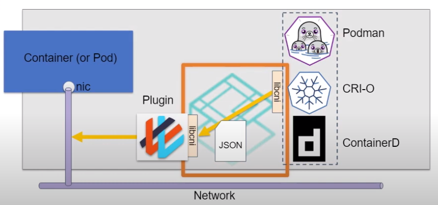

# Container Native Interface(CNI)

## Overview

Container Native Interface or shortly CNI, is the protocol for container runtimes such as CRIO or Podmam to request that a network plug-in such as flannel or ovn-kubernetes to connect a container to the network.
The container runtime creates the cotnainer and then it calls the CNI plugin which will create and configure a network interface(or more) in the container namespace.
CNI doesn't define how the plugin connects the container to the network.

## Execution Flow

There are four basic commands in the CSI spec: ADD, DEL, CHECK and VERSION.
The plugins themselfs are executables and they are called by the continer runtime when a network operation is required, for example when a pod is created.
The plugins except instructions via JSON and report the result of the operation in JSON.
