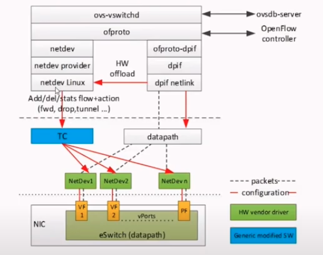
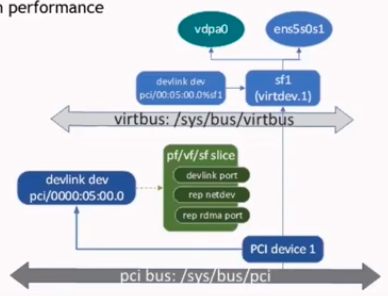
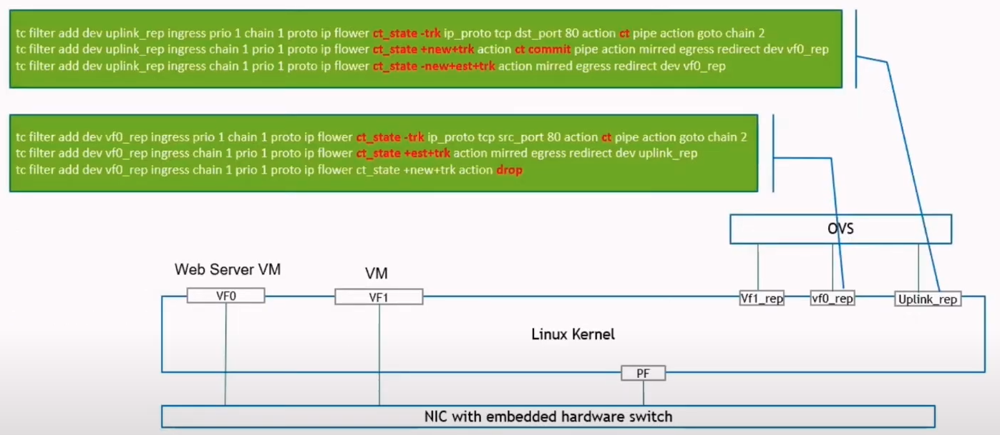
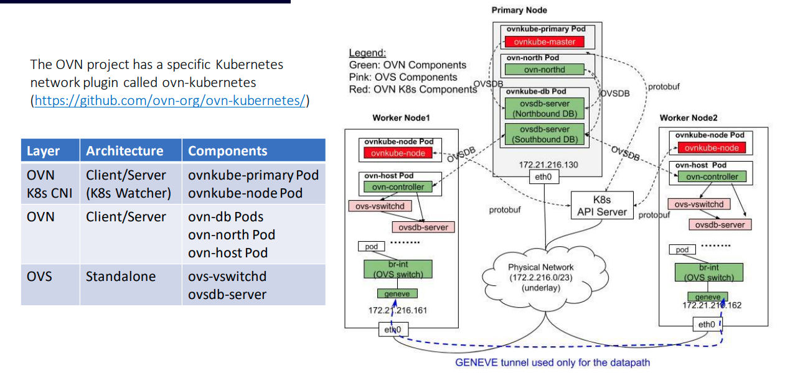
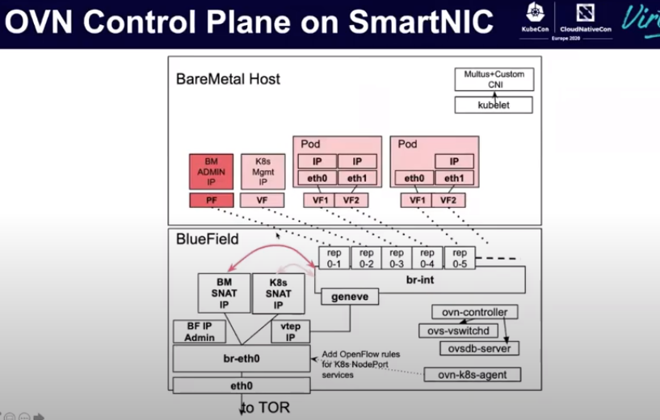
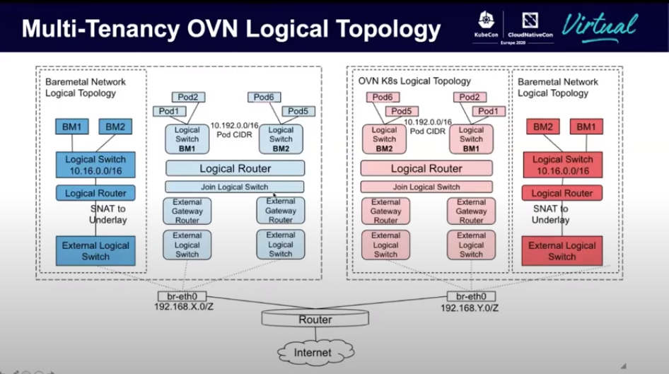

# Hardware offload for K8S container networking

## OVS Support for HW offload

The problem with this flow is that it is limited by scale.
Each pod is assigned an SRIOV virtual function(VF), and we are limited by the number of VFs which the hardware can provide. Also it has the static nature of PCI, therfor VFs cannot be created on the fly.
To solve this issue "scalable functions" are developed.
Scalable functions address the scalability constrains of SRIOV while keeping high performance.

- Fully compatible with OVS offloads
- Dynamocally allocated.
- Each SD has it's own netdev.

Scalable functions are located on the virtbus "/sys/bus/virtbus/devices/virtdev.1/sfnum" and are managed via `devlink`, for example to create a `devlink port add ${pci-device}/${optinal-index} flavor pcisf sfnum ${optional sdnum}`.

# TC Connection tracking hardware offload

## Connection tracking (CT)

Connection tracking is a building block for stateful packet filtering:

- It is a database of connections, once a packets comes in we can look up the state of the connection for this packet in the DB and if we don't find it create a new entry.
- Associates a CT state with the connection - newm established, related.
- Initializes under defined mark and label value.
- Performs NAT -flagged with snat/dnat ct state.
- Validates the packets - controlled with tcp_liberal flag

Connection tracking is used by multiple user-space applications such as iptables, nft and openvswitch to provide users the ability to configure stateful packet filtering.

## Connection tracking in TC

[Uncomplete, need to summries youtube talk](https://www.youtube.com/watch?v=gWklbJSk0YI).

A TC action and Classifier were added to CT.
The TC the action uses netfilter conntrack module, when a packet comes into the TC action it calls the netfilter conntrack module which does the connection lookup, NAT and it sets the ct_state, mark and label.
The classifier is an extention fot the flower classifier matching, which allow is to match on the ct_stat, mark and label.

In the above senerio we are running a VM which has a VF NIC that is running some webserver. We want to allow ingress HTTP trafic to go to the VM and track the connection and that trafic leaving the VM will only be on established connections.

## Connection tracking Offload

We can't offload all the connection tracking to the hardware because we still need the software to manage setup and teardown of connections, but we can offload established connections. That means that new and termenating packages will go through the software but packets which are a part of a connection can be handled by the hardware.
For all that to work we need the platform to notify the drivers on new and terminated connections.

### Offloading established connections

We relay on a netfilter flow table which keeps track of established connections.
When a new packet comes into our CT action we will look it up in the nf flow table and if it exist then we set the info on it, age the connection and pass it on, if it is not found on the netfilter flow table then we will pass it to the netfilter conntracl module in the kernel to create the connection.

# Network Isolation and Security Policies for Kubernetes Bare-metal nodes

[talk](https://www.youtube.com/watch?v=AjEgSUN1aYw)

