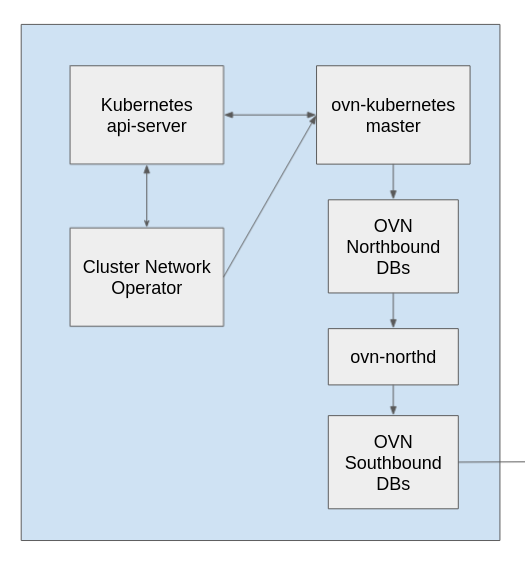
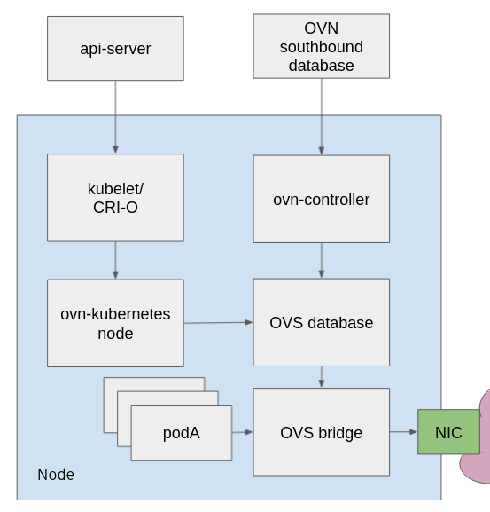
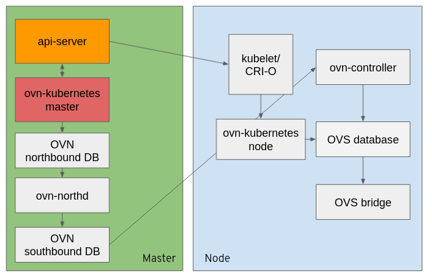

# Openshift networking and OVN K8S

## OVN K8S

### What is OVN (Open Virtual Network)

OVN is a network virtualization platform based on Open vSwitch (OVS), Originally it was part of the OVS project, now it is a Linux Foundation project.
Features:
1. Manages overlays and physical network connectivity
2. Flexible security policies (ACLs)
3. Distributed L3 routing, IPv4 and IPv6, L2/L3 Gateways
4. Native support for NAT, load balancing, DHCP and RA
5. Works with Linux, DPDK, and Hyper-V
6. Designed to be integrated into other systems like OpenStack, Kubernetes, Mesos, oVirt, VMWare, NVidia, eBay, many others

### Network requirements in OpenShift

Kubernetes has a few main requirements for the network:

- Every Pod must have it’s own unique IP .
- Any pod should be able to talk to any other pod on the cluster without NAT (Network Address Translation).
- Agents on a node (e.g. system daemons, kubelet) can communicate with all pods on that node.

All those requirements are not implemented within Kubernetes, there are varius network plugins such as OVN-Kubernetes and Flannel which follow a standart(spec) called [Container Network Interface(CNI)](https://github.com/containernetworking/cni/blob/master/SPEC.md) which defines what the plagin (program that applies a specified network configuration) needs to implement in order to integrate with Kubernetes.

### What is OVN K8S

OVN K8S is a CNI network plugin for kubernetes, see [github](https://github.com/ovn-org/ovn-kubernetes) which is used to provide communication between kubernetes nodes.
It uses OVN on OVS as the abstraction to manage network traffic flows on the node.
OVN creates an overlay network between nodes bu using the Geneve (Generic Network Virtualization Encapsulation) protocol rather than VXLAN (used by OpenShift SDN).
Creates logical network topologies, such as, Logical switches, routers, ports, acls (network policies), load balancers etc..
It does not need kube-proxy like SDN

#### OVN-Kubernetes Architecture: Master 

There are 4 OVN process(containers) that are running on the ovn kubernetes master pod:

##### OVN-Kubernetes Master 

It is an OVN K8S component that watches cluster evens (Pods, Namespaces, Services, Endpoints, NetworkPolicy) and translates them into OVN logical network elements (logical switches, ACLs, logical routers, switch ports) which are stored in OVN-NBDB(Northbound database).
For example. a new pod is being create, what OVN componetns needs to be defined for it.
It always tracks the state of the Kube-API and treats it as the single source of truth.
It Manages pod subnet allocation to nodes 

##### OVN-Northbound DB 

OVN-Northbound DB is an high level overview of the network, which is translated into a low lever view of the network by ovn-northd.

##### OVN-northd DB 

Listens to changes on the Northbound DB and decomposes the higher level network representation(logical networks) into lower-level logical flows and stores them on Southbound DB

##### OVN-Soutbound DB 

#### OVN-Kubernetes Architecture: Node

On the Node we have 2 main processes(containers) that are running:

##### OVN-Controller

Is a native OVN component that watches events from the OVN Southbound DB and translates the sbdb logical flows into OpenFlow and sends them to the node’s OVS daemon.
It Matches "physical" OVS ports with OVN logical ports

##### OVN-Kube Node

It is called as CNI plugin (just an executable) from kublet/CRI-O, it is the bridge between the processes running on the node kublet/CRI-O and the networking plugin running in K8S.
It is responsable for:
- IP address managment.
- Retrieves IPAM(IP Address Management) details from Kube API (written by ovn-kubernetes master)
- Sets up firewall rules and routes for HostPort and Service access from node
- Creates physical OVS port on bridge and moves it into the corrent pod network namespace.
- Deletes entities when pods die.

## What happends when a pod is created

The K8S schedualler selects a node to run the pod on, and then 2 processes are started in parallel, on on the node which was selected, and one on the master which is the leader.

### Node

Kubelet asks CRIO(container runtime for kubernetes) to create the podsandbox.
A podsandbox is an initial container launched to setup a networking environment that can be used by all the containers in the pod.
CRI-O: creates the container and sets up networking.
1. Calls CNI_ADD to execute the CNI binary (ovn-k8s-cni-overlay) 
2. The CNI binary sends http message to our CNI plugin (ovnkube-node) to do a cni_add.
3. The CNI plugin does the necessary work to get the networking working on the pod.
The ovnkube-node then does the most important thing, which is to configure the pod interface. It creates the veth pair and sets-up the interface for the pod. One end of the veth pair is connected to the pod while the other end is connected to the ovs bridge on the host. It also then creates the corresponding ovs-ports.
Once it creates the veth pair ovnkube basically then waits for the annotations to be set by the master and for the pod flows to be created in ovs to return the interface with those details.

### Master

The ovn-kubernetes master container adds a logical switch port into the OVN logical switch which is present on every node. Then it assigns the pod an IP address from the pool of available IP address and it reserve that IP address in OVN to prevent another pod from getting this IP address.
After it gets the IP address it adds an annotation to the port which contains the pod IP address, the mac address and the gateway IPs.
The ovn-kubernetes master writes all those OVN logical object into the nbdb, and then the northd process translates them into OVN logical flows into the sbdb.
Once the sbdb gets the OVN logical flows the ovn-controller which is running on the selected node it translates then into OVS OpenFlows in the OVS deamon.

*** Read OpenShift and OVN Technical Dive again and update

## The lifecycle of an ICMP packet

Useful links:

- Openshift Networking  + OVN-Kubernetes:
https://docs.google.com/presentation/d/1vlEjEqqVz02P4_oubt_FmMSHrvpS8ewmHWNuEl4lKDI/edit?usp=sharing
- OpenShift and OVN Technical Dive:
https://docs.google.com/presentation/d/1iktpCdAsdaJPJe7Yk36T-BtYwuB04oc3lHdMHH2qBcw/edit?usp=sharing
