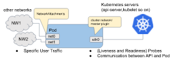

# Single Root I/O Virtualization (SR-IOV) In Kubernetes

## What is SR-IOV

Single Root IO Virtualization (SR-IOV) is a specification that allows a PCIe device to appear to be multiple separate physical PCIe devices.
SR-IOV works by introducing the idea of physical functions (PFs) and virtual functions (VFs):
- **Physical functions(PFs)** are full-featured PCIe functions, they are discovered, managed, and manipulated by the host like any other PCIe device, it usually represents a single NIC port.
- **Virtual functions(VFs)** are “lightweight” functions that lack configuration resources. basically, they only have the ability to move data in and out. VFs can’t be configured, because that would change the underlying PF and thus all other VFs; configuration can only be done against the PF.

So what is the benifit of using SR-IOV?
Basically, you get the ability for that PCIe device to present multiple instances of itself up to the OS instance or hypervisor. The number of virtual instances that can be presented depends upon the device.

## SR-IOV on K8S

To use SR-IOV on K8S we need to use the following projects:

### Multus-CNI

Multus CNI enables attaching multiple network interfaces to pods in Kubernetes.
Typically, in Kubernetes each pod only has one network interface, with Multus you can create a multi-homed pod that has multiple interfaces. This is accomplished by Multus acting as a "meta-plugin", a CNI plugin that can call multiple other CNI plugins.

#### Multi-Homed pod

The diagram shows the pod with three interfaces: eth0, net0 and net1. eth0 connects kubernetes cluster network to connect with kubernetes server/services (e.g. kubernetes api-server, kubelet and so on). net0 and net1 are additional network attachments and connect to other networks by using other CNI plugins (e.g. vlan/vxlan/ptp).

### How to use

To use multus you first need to install the K8S with a CNI supported default network, for exaple ovn-kubernetes, then for each additional network you need to created a NetworkAttachmentDefinition resource.
NetworkAttachmentDefinition is a CRD which is created by the multus deployment, is used to setup the network attachment, i.e. secondary interface for the pod, There are two ways to configure the 'NetworkAttachmentDefinition' as following:

- NetworkAttachmentDefinition with json CNI config
- NetworkAttachmentDefinition with CNI config file

[Github](https://github.com/k8snetworkplumbingwg/multus-cni)

### SR-IOV CNI plugin

This plugin enables the configuration and usage of SR-IOV VF networks in containers and orchestrators like Kubernetes.
With SR-IOV CNI each VF can be treated as a separate network interface, assigned to a container, and configured with it's own MAC, VLAN, IP and more.
SR-IOV CNI plugin works with SR-IOV device plugin for VF allocation in Kubernetes.
A metaplugin such as Multus gets the allocated VF's deviceID(PCI address) and is responsible for invoking the SR-IOV CNI plugin with that deviceID.

[Github](https://github.com/k8snetworkplumbingwg/sriov-cni)

### SR-IOV network device plugin

The SR-IOV Network Device Plugin is [Kubernetes device plugin](https://kubernetes.io/docs/concepts/extend-kubernetes/compute-storage-net/device-plugins/) for discovering and advertising SR-IOV virtual functions (VFs) available on a Kubernetes host.

**Features:**

- Handles SR-IOV capable/not-capable devices (NICs and Accelerators alike)
- Supports devices with both Kernel and userspace (UIO and VFIO) drivers
- Allows resource grouping using "Selector"
- User configurable resourceName
- Detects Kubelet restarts and auto-re-register
- Detects Link status (for Linux network devices) and updates associated VFs health accordingly
- Extensible to support new device types with minimal effort if not already supported
- Works within virtual deployments of Kubernetes that do not have virtualized-iommu support (VFIO No-IOMMU support)

### SR-IOV network operator

The Sriov Network Operator is designed to help the user to provision and configure SR-IOV CNI plugin and Device plugin in the Openshift cluster.

**Features:**

- Initialize the supported SR-IOV NIC types on selected nodes.
- Provision/upgrade SR-IOV device plugin executable on selected node.
- Provision/upgrade SR-IOV CNI plugin executable on selected nodes.
- Manage configuration of SR-IOV device plugin on host.
- Generate net-att-def CRs for SR-IOV CNI plugin
- Supports operation in a virtualized Kubernetes deployment:
    - Discovers VFs attached to the Virtual Machine (VM).
    - Does not require attached of associated PFs.
    - VFs can be associated to SriovNetworks by selecting the appropriate PciAddress as the RootDevice in the SriovNetworkNodePolicy.

The SR-IOV network operator introduces following new CRDs:

**SriovNetwork:**

A custom resource of SriovNetwork could represent the a layer-2 broadcast domain where some SR-IOV devices are attach to. It is primarily used to generate a NetworkAttachmentDefinition CR with an SR-IOV CNI plugin configuration.

This SriovNetwork CR also contains the ‘resourceName’ which is aligned with the ‘resourceName’ of SR-IOV device plugin. One SriovNetwork obj maps to one ‘resoureName’, but one ‘resourceName’ can be shared by different SriovNetwork CRs.

**SriovNetworkNodeState:**

The custom resource to represent the SR-IOV interface states of each host, which should only be managed by the operator itself.

The ‘spec’ of this CR represents the desired configuration which should be applied to the interfaces and SR-IOV device plugin.
The ‘status’ contains current states of those PFs (baremetal only), and the states of the VFs. It helps user to discover SR-IOV network hardware on node, or attached VFs in the case of a virtual deployment.
The spec is rendered by sriov-policy-controller, and consumed by sriov-config-daemon. Sriov-config-daemon is responsible for updating the ‘status’ field to reflect the latest status, this information can be used as input to create SriovNetworkNodeConfigPolicy CR.

**SriovNetworkNodeConfigPolicy:**

This CRD is the key of SR-IOV network operator. This custom resource should be managed by cluster admin, to instruct the operator to:

Render the spec of SriovNetworkNodeState CR for selected node, to configure the SR-IOV interfaces. In virtual deployment, the VF interface is read-only.
Deploy SR-IOV CNI plugin and device plugin on selected node.
Generate the configuration of SR-IOV device plugin.

