# Linux Networking

To understand the implementation of networking in Kubernetes, we will need to understand the fundamentals of networking in Linux. Ultimately, Kubernetes is a complex management tool for Linux machines, and this is hard to ignore while working with the Kubernetes network stack.

## Sockets and Connections

Sockets:
When a program is running it needs to listen to an IP and Port, to do so it opens a socket with the IP and Port it needs and bind to it. Most of the time the program will use an IP wild card(IPv4 0.0.0.0\ IPv6[::]) since we can't know the IP we will get and IP can change.
There are multiple ways to inspect sockets. For example, ls -lah /proc/\<server proc\>/fd will list the sockets, and there are varius tools to provide more readable information.

Connections:
The kernel maps a given packet to a specific connection and uses an internal state machine to manage the connection state. Like sockets, connections can be inspected through various tools. Linux represents each connection with a file. Accepting a connection entails a notification from the kernel to our program, which is then able to stream content to and from the file.
We can use strace to show what the server is doing.

## **The Network Interface**

Computers use a network interface to communicate with the outside world. Network interfaces can be physical (e.g., an Ethernet network controller) or virtual. Virtual network interfaces do not correspond to physical hardware; they are abstract interfaces provided by the host or hypervisor.

IP addresses are assigned to network interfaces. A typical interface may have one IPv4 address and one IPv6 address, but multiple addresses can be assigned to the same interface. To see a list of all network interfaces and their configurations (including IP addresses) run `ifconfig` or `ip`.

The loopback interface (usuallt called lo) is a special interface for same-host communication. 127.0.0.1 is the standard IP address for the loopback interface. Packets sent to the loopback interface will not leave the host, and processes listening on 127.0.0.1 will be accessible only to other processes on the same host. 

### **Bridge Interface**

The bridge interface (shown in Figure 2-1) allows system administrators to create multiple layer 2 networks on a single host. In other words, the bridge functions like a network switch between network interfaces on a host, seamlessly connecting them. Bridges allow pods, with their individual network interfaces, to interact with the broader network via the node’s network interface.

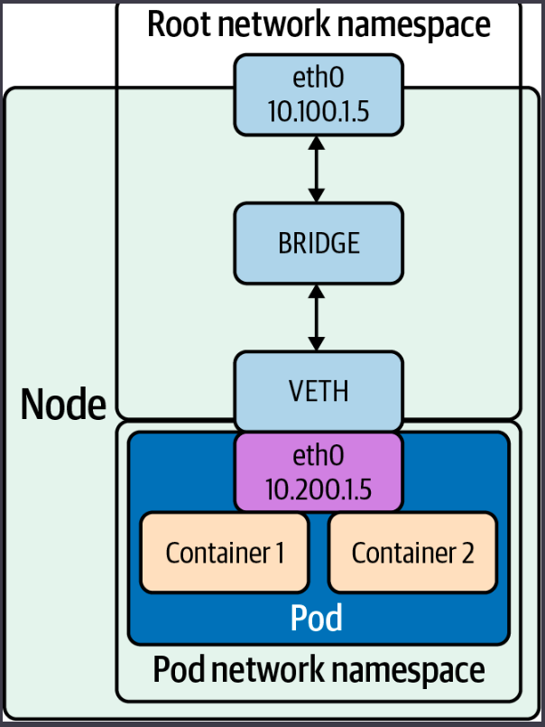

More on Bridges can be found [Here](https://wiki.linuxfoundation.org/networking/bridge).

The veth device is a local Ethernet tunnel. Veth devices are created in pairs, as we can see above, where the pod sees an eth0 interface from the veth. Packets transmitted on one device in the pair are immediately received on the other device. When either device is down, the link state of the pair is down.

## **Packet Handling in the Kernel**

The Linux kernel is responsible for translating between packets, and a coherent stream of data for programs. In particular, we will look at how the kernel handles connections because routing and firewalling, key things in Kubernetes, rely heavily on Linux’s underlying packet management.

### **Netfilter**

Netfilter, included in Linux since 2.3, is a critical component of packet handling. Netfilter is a framework of kernel hooks, which allow userspace programs to handle packets on behalf of the kernel. In short, a program registers to a specific Netfilter hook, and the kernel calls that program on applicable packets. That program could tell the kernel to do something with the packet (like drop it), or it could send back a modified packet to the kernel. With this, developers can build normal programs that run in userspace and handle packets.
Netfilter has five hooks, which are triggered under specific stages in a packet’s journey through the kernel:

Hook | Iptables chain name | Description
NF_IP_PRE_ROUTING() | PREROUTING() | Triggers when a packet arrives from an external system.
NF_IP_LOCAL_IN | INPUT | Triggers when a packet’s destination IP address matches this machine.
NF_IP_FORWARD | NAT | Triggers for packets where neither source nor destination matches the machine’s IP addresses (in other words, packets that this machine is routing on behalf of other machines).
NF_IP_LOCAL_OUT | OUTPUT | Triggers when a packet, originating from the machine, is leaving the machine.
NF_IP_POST_ROUTING | POSTROUTING | Triggers when any packet (regardless of origin) is leaving the machine.

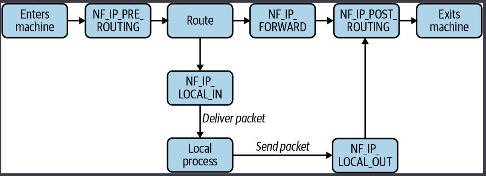

Programs can register a hook by calling NF_REGISTER_NET_HOOK with a handling function. The hook will be called every time a packet matches. This is how programs like iptables integrate with Netfilter, though you will likely never need to do this yourself.

There are several actions that a Netfilter hook can trigger, based on the return value:

Accept: Continue packet handling.
Drop: Drop the packet, without further processing.
Queue: Pass the packet to a userspace program.
Stolen: Doesn’t execute further hooks, and allows the userspace program to take ownership of the packet.
Repeat: Make the packet “re-enter” the hook and be reprocessed.

Hooks can also return mutated packets. This allows programs to do things such as reroute or masquerade packets, adjust packet TTLs, etc.

#### **Conntrack**

Conntrack is a component of Netfilter used to track the state of connections to (and from) the machine.
Connection tracking directly associates packets with a particular connection, without it the flow of packets is much more opaque.

Connection tracking allows firewalls to distinguish between responses and arbitrary packets. A firewall can be configured to allow inbound packets that are part of an existing connection but disallow inbound packets that are not part of a connection.

NAT relies on Conntrack to function. iptables exposes NAT as two types:
- SNAT (source NAT), where iptables rewrites the source address
- DNAT (destination NAT), where iptables rewrites the destination address.
With connection tracking, packets are automatically associated with their connection and easily modified with the same SNAT/DNAT change. This enables consistent routing decisions, such as “pinning” a connection in a load balancer to a specific backend or machine. The latter example is highly relevant in Kubernetes, due to kube-proxy’s implementation of service load balancing via iptables. Without connection tracking, every packet would need to be deterministically remapped to the same destination, which isn’t doable (suppose the list of possible destinations could change…).

Conntrack identifies connections by a tuple, composed of source address, source port, destination address, destination port, and L4 protocol(UDP or TCP). Conntrack refers to these connections as flows. A flow contains metadata about the connection and its state.

Conntrack stores flows in a hash table, using the connection tuple as a key.
The size of the keyspace is configurable. A larger keyspace requires more memory to hold the underlying array but will result in fewer flows hashing to the same key and being chained in a linked list, leading to faster flow lookup times.
Other configurable options are the maximum number of flows, timeout for a connection and more.
Conntrack’s max size is normally set in /proc/sys/net/nf_conntrack_max, and the hash table size is normally set in /sys/module/nf_conntrack/parameters/hashsize.

Conntrack entries contain a connection state, which is one of four states:

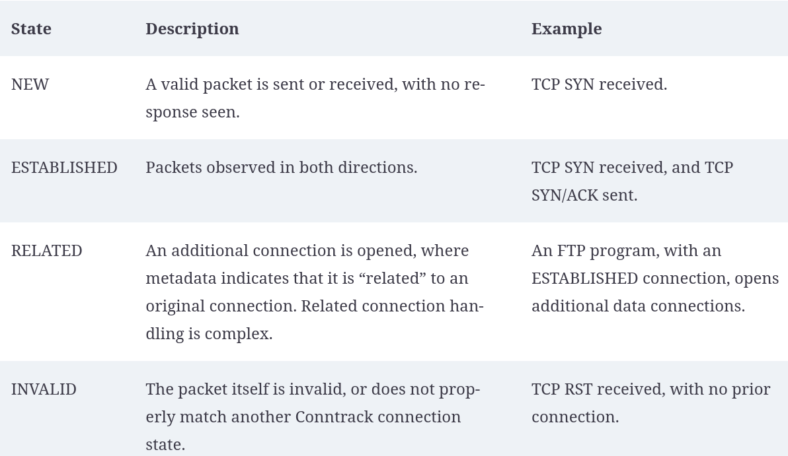

Although Conntrack is built into the kernel, it may not be active on your system. Certain kernel modules must be loaded, and you must have relevant iptables rules (essentially, Conntrack is normally not active if nothing needs it to be). Conntrack requires the kernel module nf_conntrack_ipv4 to be active. lsmod | grep nf_conntrack will show if the module is loaded, and sudo modprobe nf_conntrack will load it.

### **Routing**

When handling any packet, the kernel must decide where to send that packet. In most cases, the destination machine will not be within the same network. For example, suppose you are attempting to connect to 1.2.3.4 from your personal computer. 1.2.3.4 is not on your network; the best your computer can do is pass it to another host that is closer to being able to reach 1.2.3.4. The route table serves this purpose by mapping known subnets to a gateway IP address and interface. You can list known routes with route (or route -n to show raw IP addresses instead of hostnames). A typical machine will have a route for the local network and a route for 0.0.0.0/0. Recall that subnets can be expressed as a CIDR (e.g., 10.0.0.0/24) or an IP address and a mask (e.g., 10.0.0.0 and 255.255.255.0).

```
# route
Kernel IP routing table
Destination     Gateway         Genmask         Flags Metric Ref    Use Iface
0.0.0.0         10.0.0.1        0.0.0.0         UG    303    0        0 eth0
10.0.0.0        0.0.0.0         255.255.255.0   U     303    0        0 eth0
```

Request to 1.2.3.4 would be sent to 10.0.0.1, on the eth0 interface, because 1.2.3.4 is in the subnet described by the first rule (0.0.0.0/0) and not in the subnet described by the second rule (10.0.0.0/24). Subnets are specified by the destination and genmask values.

Linux prefers to route packets by specificity (how “small” a matching subnet is) and then by weight (“metric” in route output). Given our example, a packet addressed to 10.0.0.1 will always be sent to gateway 0.0.0.0 because that route matches a smaller set of addresses. If we had two routes with the same specificity, then the route with a lower metric wiould be preferred.

Some CNI plugins make heavy use of the route table.

## **High-Level Routing**

Linux has complex packet management abilities. Such tools allow Linux users to create firewalls, log traffic, route packets, and even implement load balancing. Kubernetes makes use of some of these tools to handle node and pod connectivity, as well as manage Kubernetes services.
All Kubernetes setups will make some use of iptables, but there are many ways that services can be managed. We will also cover IPVS (which has built-in support in kube-proxy), and eBPF, which is used by Cilium (a kube-proxy alternative).

### **iptables**

iptables is staple of Linux sysadmins and has been for many years. iptables can be used to create firewalls and audit logs, mutate and reroute packets, and even implement crude connection fan-out. iptables uses Netfilter, which allows iptables to intercept and mutate packets.

iptables rules can become extremely complex. There are many tools that provide a simpler interface for managing iptables rules; for example, firewalls like ufw and firewalld. Kubernetes components (specifically, kubelet and kube-proxy) generate iptables rules in this fashion. Understanding iptables is important to understand access and routing for pods and nodes in most clusters.

There are three key concepts in iptables: tables, chains, and rules. They are considered hierarchical in nature: a table contains chains, and a chain contains rules.

**Tables** organize rules according to the type of effect they have. iptables has a broad range of functionality, which tables group together. The three most commonly applicable tables are: Filter (for firewall-related rules), NAT (for NAT-related rules), and Mangle (for non-NAT packet-mutating rules). iptables executes tables in a specific order.

**Chains** contain a list of rules. When a packet executes a chain, the rules in the chain are evaluated in order. Chains exist within a table and organize rules according to Netfilter hooks. There are five built-in, top-level chains, each of which corresponds to a Netfilter hook.Therefore, the choice of which chain to insert a rule dictates if/when the rule will be evaluated for a given packet.

**Rules** are a combination condition and action (referred to as a target). For example, “if a packet is addressed to port 22, drop it.” iptables evaluates individual packets, although chains and tables dictate which packets a rule will be evaluated against.

#### **Tables**

A table in iptables maps to a particular capability set, where each table is “responsible” for a specific type of action. In more concrete terms, a table can contain only specific target types, and many target types can be used only in specific tables. iptables has five tables:

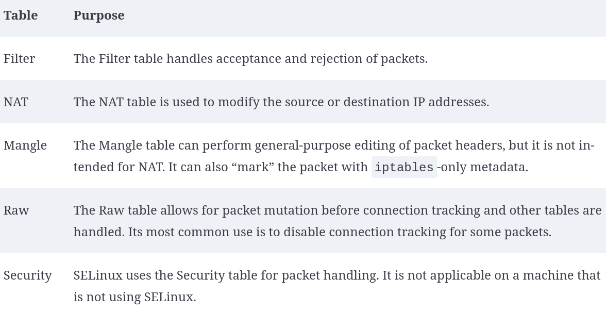

iptables executes tables in a particular order: Raw, Mangle, NAT, Filter. However, this order of execution is broken up by chains. Linux users generally accept the mantra of “tables contains chains,” but this may feel misleading. The order of execution is chains, then tables. So, for example, a packet will trigger Raw PREROUTING, Mangle PREROUTING, NAT PREROUTING, and then trigger the Mangle table in either the INPUT or FORWARD chain (depending on the packet).

#### **Chains**

iptables chains are a list of rules. When a packet triggers or passes through a chain, each rule is sequentially evaluated, until the packet matches a “terminating target” (such as DROP), or the packet reaches the end of the chain.
The built-in, “top-level” chains are powered by Netfilter hooks:
PREROUTING(NF_IP_PRE_ROUTING), INPUT(NF_IP_LOCAL_IN), NAT(NF_IP_FORWARD), OUTPUT(NF_IP_LOCAL_OUT), and POSTROUTING(NF_IP_POST_ROUTING).
Most chains do not contain all tables, however, the relative execution order of the tables remains the same within each chain.

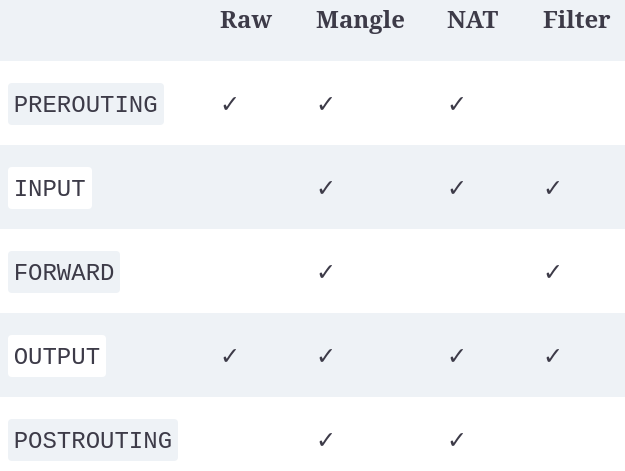

So the full flow of a packet through iptables would be:

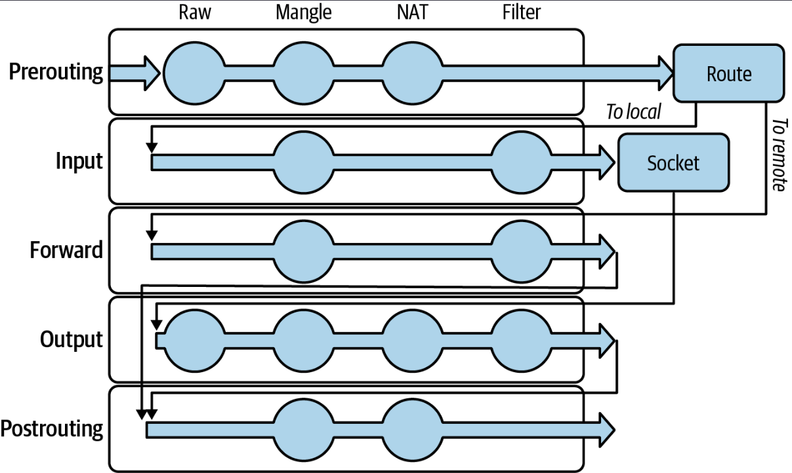

All iptables rules belong to a table and chain, the possible combinations of which are represented as dots in our flow chart. iptables evaluates chains (and the rules in them, in order) based on the order of Netfilter hooks that a packet triggers. For the given chain, iptables evaluates that chain in each table that it is present in.

#### **Subchains**

Chains are the top-level, or entry-point, chains. However, users can define their own subchains and execute them with the JUMP target. iptables executes such a chain in the same manner, target by target, until a terminating target matches. This can be useful for logical separation or reusing a series of targets that can be executed in more than one context (i.e., a similar motivation to why we might organize code into a function). Such organization of rules across chains can have a substantial impact on performance. iptables is, effectively, running tens or hundreds or thousands of if statements against every single packet that goes in or out of your system. That has measurable impact on packet latency, CPU use, and network throughput. A well-organized set of chains reduces this overhead by eliminating effectively redundant checks or actions. However, iptables’s performance given a service with many pods is still a problem in Kubernetes, which makes other solutions with less or no iptables use, such as IPVS or eBPF, more appealing.

Example, Sample iptables chain for SSH firewalling:
```
# Create incoming-ssh chain.
$ iptables -N incoming-ssh

# Allow packets from specific IPs.
$ iptables -A incoming-ssh -s 10.0.0.1 -j ACCEPT
$ iptables -A incoming-ssh -s 10.0.0.2 -j ACCEPT

# Log the packet.
$ iptables -A incoming-ssh -j LOG --log-level info --log-prefix "ssh-failure"

# Drop packets from all other IPs.
$ iptables -A incoming-ssh -j DROP

# Evaluate the incoming-ssh chain,
# if the packet is an inbound TCP packet addressed to port 22.
$ iptables -A INPUT -p tcp --dport 22 -j incoming-ssh
```

#### Rules

Rules have two parts: a match condition and an action (called a target). The match condition describes a packet attribute. If the packet matches, the action will be executed. If the packet does not match, iptables will move to check the next rule.

Match conditions check if a given packet meets some criteria, for example, if the packet has a specific source address. The order of operations from tables/chains is important to remember, as prior operations can impact the packet by mutating it, dropping it, or rejecting it. Some common match types:

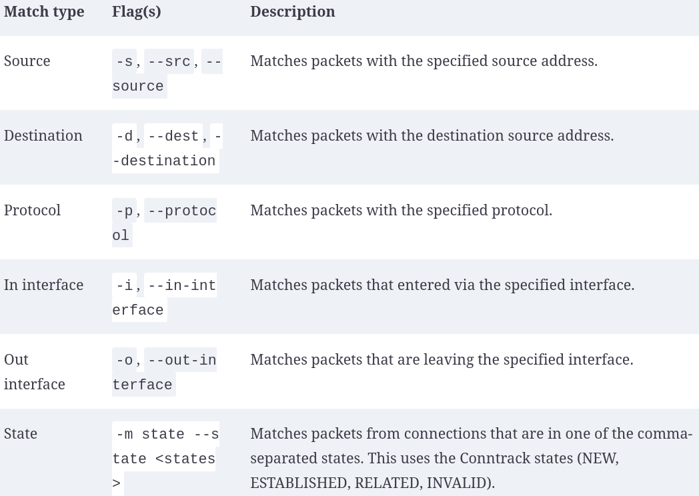

There are two kinds of target actions: terminating and nonterminating. A terminating target will stop iptables from checking subsequent targets in the chain, essentially acting as a final decision. A nonterminating target will allow iptables to continue checking subsequent targets in the chain. ACCEPT, DROP, REJECT, and RETURN are all terminating targets. Note that ACCEPT and RETURN are terminating only within their chain. That is to say, if a packet hits an ACCEPT target in a subchain, the parent chain will resume processing and could potentially drop or reject the target. 

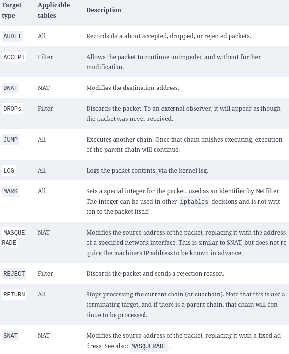

Some iptables examples:

- show iptables chains with iptables -L.
- The typical format of a command to interact with iptables rules is:
```
iptables [-t table] {-A|-C|-D} chain rule-specification
where -A is for append, -C is for check, and -D is for delete.
```
- masquerade: iptables can masquerade connections, making it appear as if the packets came from their own IP address. This is useful to provide a simplified exterior to the outside world. A common use case is to provide a known host for traffic, as a security bastion, or to provide a predictable set of IP addresses to third parties. In Kubernetes, masquerading can make pods use their node’s IP address, despite the fact that pods have unique IP addresses. This is necessary to communicate outside the cluster in many setups, where pods have internal IP addresses that cannot communicate directly with the internet. The MASQUERADE target uses the address of a specified interface. This is slightly less performant than SNAT in cases where the new source address is static, as iptables must continuously fetch the address:

```
iptables -t nat -A POSTROUTING -o eth0 -j MASQUERADE
```

Note, iptables rules aren’t persisted across restarts. iptables provides iptables-save and iptables-restore tools, which can be used manually or with simple automation to capture or reload rules.

### **IPVS**

IP Virtual Server (IPVS) is a Linux connection (L4) load balancer.

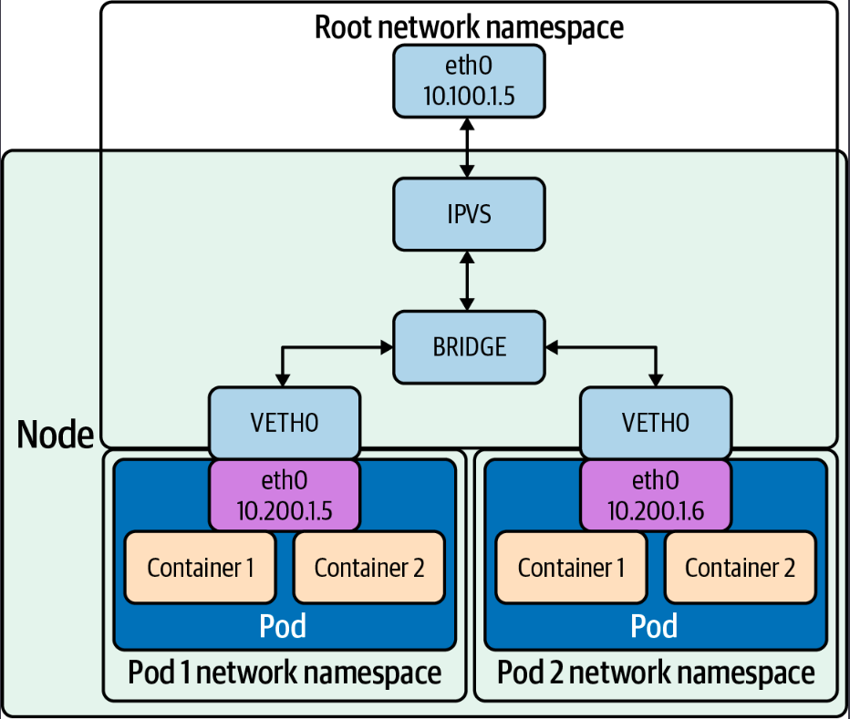

iptables can do simple L4 load balancing by randomly routing connections, with the randomness shaped by the weights on individual DNAT rules.
IPVS supports multiple load balancing modes, which allows IPVS to spread load more effectively than iptables, depending on IPVS configuration and traffic patterns.

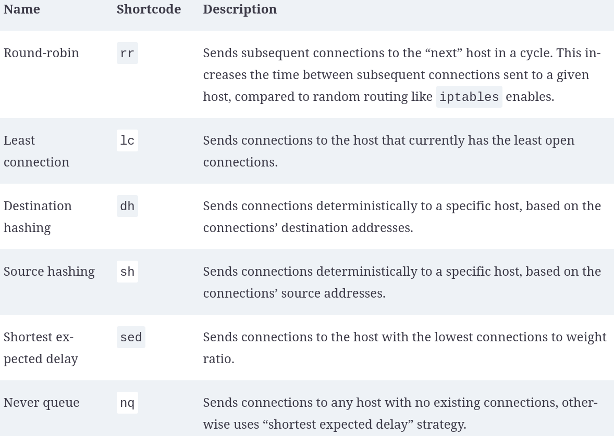

IPVS supports packet forwarding modes:

- NAT rewrites source and destination addresses.
- DR encapsulates IP datagrams within IP datagrams.
- IP tunneling directly routes packets to the backend server by rewriting the MAC address of the data frame with the MAC address of the selected backend server.

There are three aspects to look at when it comes to issues with iptables as a load balancer:

- **Number of nodes in the cluster**: Even though Kubernetes already supports 5,000 nodes in release v1.6, kube-proxy with iptables is a bottleneck to scale the cluster to 5,000 nodes. One example is that with a NodePort service in a 5,000-node cluster, if we have 2,000 services and each service has 10 pods, this will cause at least 20,000 iptables records on each worker node, which can make the kernel pretty busy.
- **Time**: The time spent to add one rule when there are 5,000 services (40,000 rules) is 11 minutes. For 20,000 services (160,000 rules), it’s 5 hours.
- **Latency**: There is latency to access a service (routing latency); each packet must traverse the iptables list until a match is made. There is latency to add/remove rules, inserting and removing from an extensive list is an intensive operation at scale.

IPVS also supports session affinity, which is exposed as an option in services (Service.spec.sessionAffinity and Service.spec.sessionAffinityConfig). Repeated connections, within the session affinity time window, will route to the same host. This can be useful for scenarios such as minimizing cache misses. It can also make routing in any mode effectively stateful (by indefinitely routing connections from the same address to the same host), but the routing stickiness is less absolute in Kubernetes, where individual pods come and go.

### **eBPF**

eBPF is a programming system that allows special sandboxed programs to run in the kernel without passing back and forth between kernel and user space, like we saw with Netfilter and iptables.

Before eBPF, there was the Berkeley Packet Filter (BPF). BPF is a technology used in the kernel, among other things, to analyze network traffic. BPF supports filtering packets, which allows a userspace process to supply a filter that specifies which packets it wants to inspect. One of BPF’s use cases is tcpdump, when you specify a filter on tcpdump, it compiles it as a BPF program and passes it to BPF.

An eBPF program has direct access to syscalls. eBPF programs can directly watch and block syscalls, without the usual approach of adding kernel hooks to a userspace program. Because of its performance characteristics, it is well suited for writing networking software.

In addition to socket filtering, other supported attach points in the kernel are as follows:

- Kprobes: Dynamic kernel tracing of internal kernel components.
- Uprobes: User-space tracing.
- Tracepoints: Kernel static tracing. These are programed into the kernel by developers and are more stable as compared to kprobes, which may change between kernel versions.
- perf_events: Timed sampling of data and events.
- XDP: Specialized eBPF programs that can go lower than kernel space to access driver space to act directly on packets.

There are many reasons to use eBPF with Kubernetes:

- **Performance (hashing table versus iptables list):**
For every service added to Kubernetes, the list of iptables rules that have to be traversed grows exponentially. Because of the lack of incremental updates, the entire list of rules has to be replaced each time a new rule is added. This leads to a total duration of 5 hours to install the 160,000 iptables rules representing 20,000 Kubernetes services.
- **Tracing:**
Using BPF, we can gather pod and container-level network statistics. The BPF socket filter is nothing new, but the BPF socket filter per cgroup is. Cgroup-bpf allows attaching eBPF programs to cgroups. Once attached, the program is executed for all packets entering or exiting any process in the cgroup.

- **Auditing kubectl exec with eBPF:**
With eBPF, you can attach a program that will record any commands executed in the kubectl exec session and pass those commands to a userspace program that logs those events.

- **Security**:
Seccomp - Secured computing that restricts what syscalls are allowed. Seccomp filters can be written in eBPF.
Falco - Open source container-native runtime security that uses eBPF.
The most common use of eBPF in Kubernetes is Cilium, CNI and service implementation. Cilium replaces kube-proxy, which writes iptables rules to map a service’s IP address to its corresponding pods.
Through eBPF, Cilium can intercept and route all packets directly in the kernel, which is faster and allows for application-level (layer 7) load balancing. 

## Network Troubleshooting Tools

Troubleshooting network-related issues with Linux is a complex topic, we will take a look at some key troubleshooting tools and the basics of their use.
Some are better suited to a given task than others (for example, multiple tools will catch TLS errors, but OpenSSL provides the richest debugging information).
Exact tool use may come down to preference, familiarity, and availability.

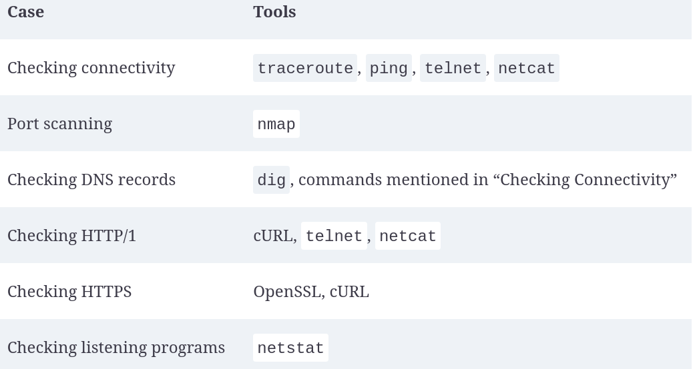

### **ping**

ping is a simple program that sends ICMP ECHO_REQUEST packets to networked devices.
It is a common, simple way to test network connectivity from one host to another.

ICMP is a layer 4 protocol, like TCP and UDP. Kubernetes services support TCP and UDP, but not ICMP. This means that pings to a Kubernetes service will always fail. Instead, you will need to use telnet or a higher-level tool such as cURL to check connectivity to a service. Individual pods may still be reachable by ping, depending on your network configuration.

The basic use of ping is simply ping \<address\> . The address can be an IP address or a domain. ping will send a packet, wait, and report the status of that request when a response or timeout happens.

### **traceroute**

traceroute shows the network route taken from one host to another. This allows users to easily validate and debug the route taken (or where routing fails) from one machine to another.
traceroute displays hosts line by line, starting with the first external machine. Each line contains the hostname (if available), IP address, and response time.

common traceroute options:

- First TTL(-f \<TTL\>, -M \<TTL\>): Set the starting IP TTL (default value: 1). Setting the TTL to n will cause traceroute to not report the first n-1 hosts en route to the destination.
- Max TTL(-m \<TTL\>): Set the maximum TTL, i.e., the maximum number of hosts that traceroute will attempt to route through.
- Protocol(-P \<protocol\>): Send packets of the specified protocol (TCP, UDP, ICMP, and sometimes other options). UDP is default.
- Source address(-s \<address\>): Specify the source IP address of outgoing packets.
- Wait(-w \<seconds\>): Set the time to wait for a probe response.

### **dig**

dig is a DNS lookup tool. You can use it to make DNS queries from the command line and display the results. The general form of a dig command is dig [options] \<domain\>.

common dig options:

- IPv4(-4): Use IPv4 only.
- IPv6(-6): Use IPv6 only.
- Address(-b \<address\>[#\<port\>]): Specify the address to make a DNS query to. Port can optionally be included, preceded by #.
- Port(-p \<port\>): Specify the port to query, in case DNS is exposed on a nonstandard port. The default is 53, the DNS standard.
- Domain(-q \<domain\>): The domain name to query. The domain name is usually specified as a positional argument.
- Record Type(-t \<type\>): The DNS record type to query. The record type can alternatively be specified as a positional argument.

### **telnet**

telnet is both a network protocol and a tool for using said protocol. telnet was once used for remote login, in a manner similar to SSH. SSH has become dominant due to having better security, but telnet is still extremely useful for debugging servers that use a text-based protocol. For example, with telnet, you can connect to an HTTP/1 server and manually make requests against it.

The basic syntax of telnet is telnet \<address\> \<port\>. This establishes a connection and provides an interactive command-line interface. Pressing Enter twice will send a command, which easily allows multiline commands to be written. Press Ctrl-J to exit the session.

To make full use of telnet, you will need to understand how the application protocol that you are using works. telnet is a classic tool to debug servers running HTTP, HTTPS, POP3, IMAP, and so on.

### **nmap**

nmap is a port scanner, which allows you to explore and examine services on your network.

The general syntax of nmap is nmap [options] \<target\>, where target is a domain, IP address, or IP CIDR. nmap’s default options will give a fast and brief summary of open ports on a host.

Because nmap can quickly show you which services are accessible from a remote machine, it can be a quick and easy way to spot services that should not be exposed. nmap is a favorite tool for attackers for this reason.

common nmap options:

- Additional detection(-A): Enable OS detection, version detection, and more.
- Decrease verbosity(-d): Decrease the command verbosity. Using multiple d’s (e.g., -dd) increases the effect.
- Increase verbosity(-v): Increase the command verbosity. Using multiple v’s (e.g., -vv) increases the effect.


### **netstat**

netstat can display a wide range of information about a machine’s network stack and connections. Invoking netstat with no additional arguments will display all connected sockets on the machine.
A common use of netstat is to check which process is listening on a specific port. To do that, we run sudo netstat -lp - l for “listening” and p for “program.”

common netstat options:
- Show all sockets(-a): Shows all sockets, not only open connections.
- Show statistics(-s): Shows networking statistics. By default, netstat shows stats from all protocols.
- Show listening sockets(-l): Shows sockets that are listening. This is an easy way to find running services.
- TCP(-t): The -t flag shows only TCP data. It can be used with other flags, e.g., -lt (show sockets listening with TCP).
- UDP(-u): The -u flag shows only UDP data. It can be used with other flags, e.g., -lu (show sockets listening with UDP).

### **Openssl**

The OpenSSL technology powers a substantial chunk of the world’s HTTPS connections. Most heavy lifting with OpenSSL is done with language bindings, but it also has a CLI for operational tasks and debugging. openssl can do things such as creating keys and certificates, signing certificates, and, most relevant to us, testing TLS/SSL connections.

Commands usually take the form openssl [sub-command] [arguments] [options]. openssl has a vast number of subcommands (for example, openssl rand allows you to generate pseudo random data). The list subcommand allows you to list capabilities, with some search options (e.g., openssl list --commands for commands).
For example `openssl s_client -connect` will connect to a server and display detailed information about the server’s certificate.

### **cURL**

cURL is a data transfer tool that supports multiple protocols, notably HTTP and HTTPS.
cURL commands are of the form curl [options] \<URL\>. cURL prints the URL’s contents and sometimes cURL-specific messages to stdout.
The default behavior is to make an HTTP GET request.

By default, cURL does not follow redirects, such as HTTP 301s or protocol upgrades. The -L flag (or --location) will enable redirect following.

Use the -X option to perform a specific HTTP verb; e.g., use curl -X DELETE foo/bar to make a DELETE request.
You can supply data (for a POST, PUT, etc.) in a few ways:
- URL encoded: -d "key1=value1&key2=value2"
- JSON: -d '{"key1":"value1", "key2":"value2"}'
- As a file in either format: -d @data.txt

The -H option adds an explicit header, although basic headers such as Content-Type are added automatically