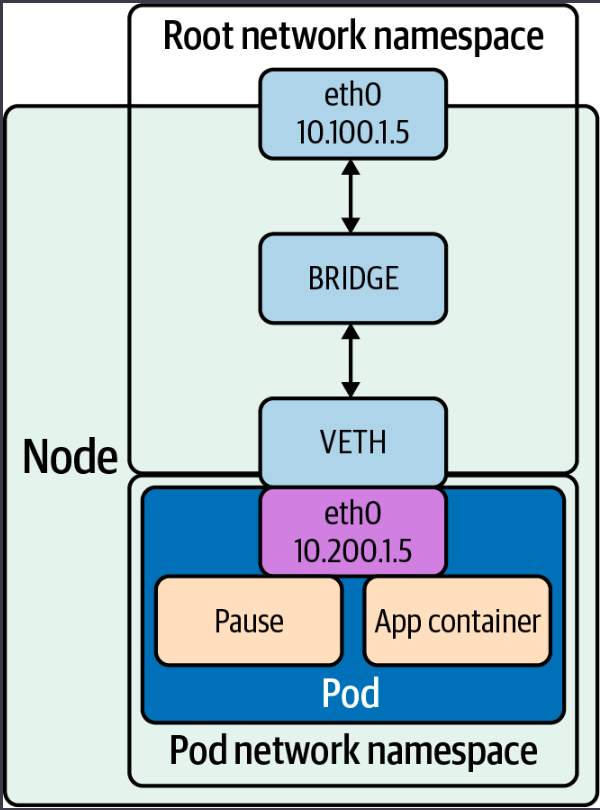
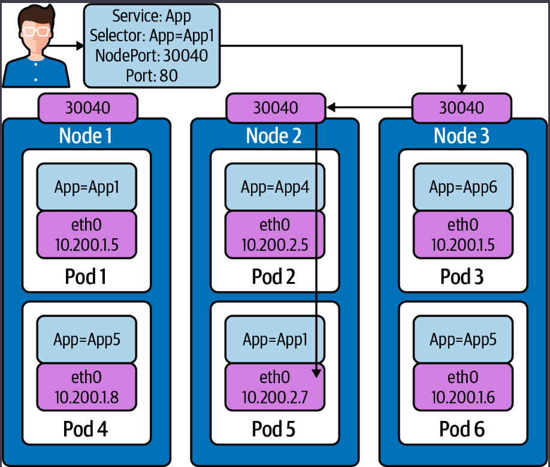
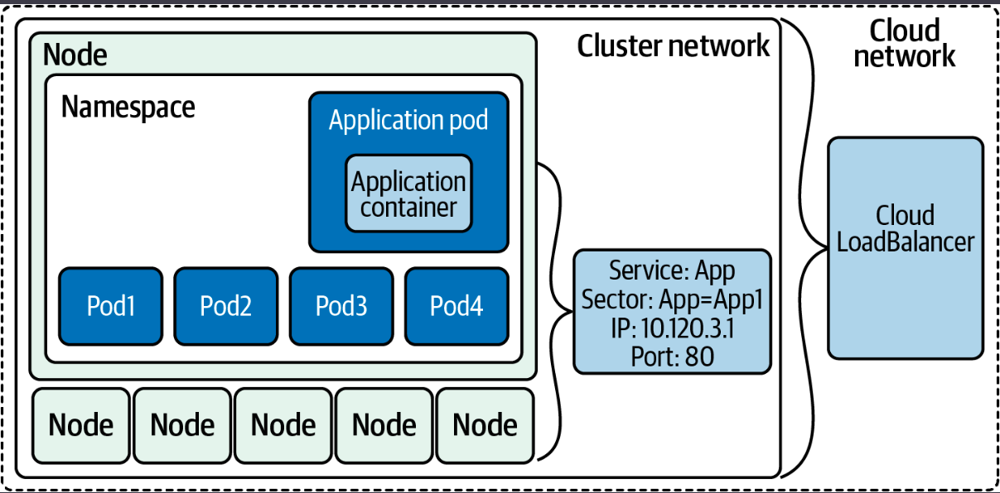
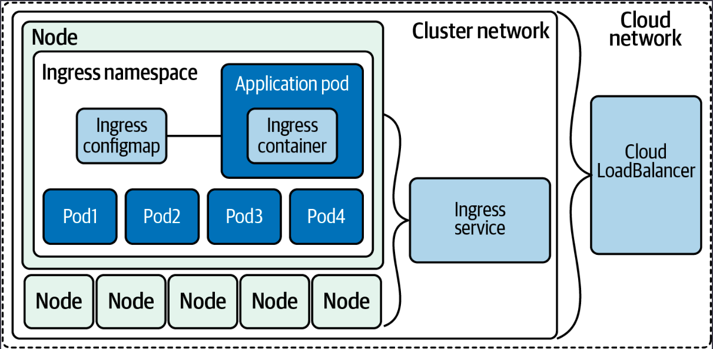
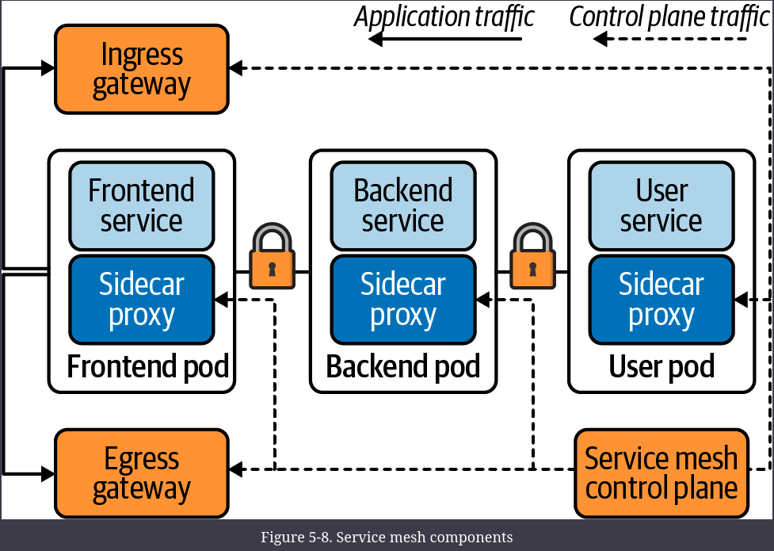

# Kubernetes Networking Abstractions

## StatefulSets

StatefulSets are a workload abstraction in Kubernetes to manage pods like you would a deployment. Unlike a deployment, StatefulSets add the following features for applications that require them:

- Stable, unique network identifiers.
- Stable, persistent storage.
- Ordered, graceful deployment and scaling.
- Ordered, automated rolling updates.

The deployment resource is better suited for applications that do not have these requirements.
StatefulSets attempt to mimic a fixed group of persistent machines. As a generic solution for stateful workloads, specific behavior may be frustrating in specific use cases. StatefulSets offer functionality for a specific use case in Kubernetes. They should not be used for everyday application deployments.

## Endpoints

Endpoints help identify what pods are running for the service it powers. Endpoints are created and managed by services.
Each endpoint contains a list of ports (which apply to all pods) and two lists of addresses: 
- ready - listed under .addresses if they are passing pod readiness checks.
- unready - listed in .notReadyAddresses if they are not passing pod readiness checks.

```yaml
apiVersion: v1
kind: Endpoints
metadata:
  labels:
    name: demo-endpoints
subsets:
- addresses:
  - ip: 10.0.0.1
- notReadyAddresses:
  - ip: 10.0.0.2
  ports:
  - port: 8080
    protocol: TCP
```

This makes endpoints a service discovery tool, where you can watch an Endpoints object to see the health and addresses of all pods.
Since the Endpoint object tracks changes in all pods, for large deployments that can become very large, so much so that it can actually slow down changes in the cluster.
To solve that issue, the Kubernetes maintainers have come up with endpoint slices.


### The problem with endpoints

kube-proxy is responsible for the per-node portions of making services work, by handling routing and outbound load balancing to all the pods in a service. To do that, kube-proxy watches all endpoints in the cluster so it knows all applicable pods that all services should route to.

Now, imagine we have a big cluster, with thousands of nodes, and tens of thousands of pods. That means thousands of kube-proxies are watching endpoints. When an address changes in an Endpoints object (say, from a rolling update, scale up, eviction, health-check failure, or any number of reasons), the updated Endpoints object is pushed to all listening kube-proxies. It is made worse by the number of pods, since more pods means larger Endpoints objects, and more frequent changes. This eventually becomes a strain on etcd, the Kubernetes API server, and the network itself. 
Kubernetes scaling limits are complex and depend on specific criteria, but endpoints watching is a common problem in clusters that have thousands of nodes. Anecdotally, many Kubernetes users consider endpoint watches to be the ultimate bottleneck of cluster size.

This problem is a function of kube-proxy’s design and the expectation that any pod should be immediately able to route to any service with no notice. Endpoint slices are an approach that allows kube-proxy’s fundamental design to continue, while drastically reducing the watch bottleneck in large clusters where large services are used.

## Endpoint Slices

Endpoint slices have similar contents to Endpoints objects but also include an array of endpoints:

```yaml
apiVersion: discovery.k8s.io/v1beta1
kind: EndpointSlice
metadata:
  name: demo-slice-1
  labels:
    kubernetes.io/service-name: demo
addressType: IPv4
ports:
  - name: http
    protocol: TCP
    port: 80
endpoints:
  - addresses:
      - "10.0.0.1"
    conditions:
      ready: true
```

The meaningful difference between endpoints and endpoint slices is not the schema, but how Kubernetes treats them.
With “regular” endpoints, a Kubernetes service creates one endpoint for all pods in the service.
But with endpoint slices a service creates multiple endpoint slices, each containing a subset of pods. The union of all endpoint slices for a service contains all pods in the service.
This way, an pod IP address change will result in a much smaller data transfer to watchers.

** Notice that because Kubernetes doesn’t have a transactional API, the same address may appear **temporarily** in multiple slices, any code consuming endpoint slices (such as kube-proxy) must be able to account for this.

The endpoint slice controller mirrors endpoints to endpoint slice, to allow systems to continue writing endpoints while treating endpoint slice as the source of truth. The exact future of this behavior, and endpoints in general, has not been finalized.
There are four exceptions that will prevent mirroring:

- There is no corresponding service.
- The corresponding service resource selects pods.
- The Endpoints object has the label endpointslice.kubernetes.io/skip-mirror: true.
- The Endpoints object has the annotation control-⁠⁠plane.alpha.kubernetes​​.io/leader.

## Kubernetes Services

A service in Kubernetes is a load balancing abstraction within a cluster.
There are four types of services, each type offers a different form of load balancing or discovery: ClusterIP, NodePort, LoadBalancer, and ExternalName.

Lets take a look at some services, we will use the following example:



The pic above outlines our pod networking status as a single pod in a cluster. The networking objects we are about to explore will expose our app pods outside the cluster in some instances and in others allow us to scale our application to meet demand.
Containers running inside pods share a network namespace. In addition, there is also a pause container that is created for each pod. The pause container manages the namespaces for the pod.

### NodePort

A NodePort service provides a simple way for external software, such as a load balancer, to route traffic to the pods. The software only needs to be aware of node IP addresses, and the service’s port(s). A NodePort service exposes a fixed port on all nodes, which routes to applicable pods. 

```
apiVersion: v1
kind: Service
metadata:
  name: demo-service
spec:
  type: NodePort
  selector:
    app: demo
  ports:
    - port: 80
      targetPort: 80
      nodePort: 30000
```

Using a NodePort service, external users can connect to the nodeport on any node and be routed to a pod on a node that has a pod backing that service.
The service directs traffic to node 3, and iptables rules forward the traffic to node 2 hosting the pod. This is a bit inefficient, as a typical connection will be routed to a pod on another node.



To configure this behaviur we can use externalTrafficPolicy.
ExternalTrafficPolicy indicates how a service will route external traffic to either node-local or cluster-wide endpoints.
- **Local** preserves the client source IP and avoids a second hop for LoadBalancer and NodePort type services but risks potentially imbalanced traffic spreading. A Local value means the kube-proxy iptable rules are set up only on the worker nodes with relevant pods running to route the traffic local to the worker node, that meams that kube-proxy will proxy requests only to node-local endpoints and will not forward traffic to other nodes. If there are no local endpoints, packets sent to the node are dropped.
- **Cluster** obscures the client source IP and may cause a second hop to another node but should have good overall load-spreading. A Cluster value means that for each worker node, the kube-proxy iptable rules are set up to route the traffic to the pods backing the service anywhere in the cluster.

The downsides of using nodePort is:
- ports must be tracked across all applications using a NodePort service. Using manually selected ports raises the issue of port collisions.
- the load balancer or client software must be aware of the node IP addresses. A static configuration may become too outdated over time (especially on a cloud provider) as IP addresses change or nodes are replaced.

NodePorts should not be used by themselves, as clients would need to know the IP addresses of hosts and the node for connection requests.

### ClusterIP

The IP addresses of pods share the life cycle of the pod and thus are not reliable for clients to use for requests. Services help overcome this pod networking design. A ClusterIP service provides an internal load balancer with a single IP address that maps to all matching (and ready) pods. The ClusterIP service address is a virtual IP address that is routable only internally.

kube-proxy is responsible for making the ClusterIP service address route to all applicable pods. In “normal” configurations, kube-proxy performs L4 load balancing, which may not be sufficient. For example, older pods may see more load, due to accumulating more long-lived connections from clients.

The ClusterIP service is the default type for services. With that default status, it is warranted that we should explore what the ClusterIP service abstracted for us:

- View the VETH pair and match with the pod.
- View the network namespace and match with the pod.
- Verify the PIDs on the node and match the pods.
- Match services with iptables rules.

The ClusterIP service is for internal traffic to the cluster, and it suffers the same issues as endpoints do. As the service size grows, updates to it will slow. 

### Headless

A headless service is a service with .spec.clusterIP: "None". This is distinct from merely not setting a cluster IP address, which makes Kubernetes automatically assign a cluster IP address.
With Headless, the service does not support any load balancing functionality. Instead, it only provisions an Endpoints object and points the service DNS record at all pods that are selected and ready.
Headless has a specific use case and is not typically used for deployments, if developers need to let the client decide which endpoint to use, headless is the appropriate type of service to deploy.

### ExternalName

ExternalName is a special type of service that does not have selectors and uses DNS names instead.

For example in the following service, when looking up the host ext-service.default.svc.cluster.local, the cluster DNS service returns a CNAME record of database.mycompany.com:

```yaml
apiVersion: v1
kind: Service
metadata:
  name: ext-service
spec:
  type: ExternalName
  externalName: database.mycompany.com
```

If developers are migrating an application into Kubernetes but its dependencies are staying external to the cluster, ExternalName service allows them to define a DNS record internal to the cluster no matter where the service actually runs.

### LoadBalancer

LoadBalancer service exposes services external to the cluster network. They combine the NodePort service behavior with an external integration, such as a cloud provider’s load balancer. Notably, LoadBalancer services handle L4 traffic (unlike ingress, which handles L7 traffic), so they will work for any TCP or UDP service, provided the load balancer selected supports L4 traffic.

LoadBalancer services are useful for exposing TCP or UDP services to the outside world. Traffic will come into the load balancer on its public IP address and TCP port 80, defined by spec.ports[*].port and routed to the cluster IP address, 10.0.5.1, and then to container target port 8080, spec.ports[*].targetPort



It is important to remember that LoadBalancer services require specific integrations and will not work without cloud provider support.
They are not (normally) L7 load balancers, and therefore cannot intelligently handle HTTP(S) requests. There is a one-to-one mapping of load balancer to workload, which means that all requests sent to that load balancer must be handled by the same workload.


### Services Conclusion

Here are some troubleshooting tips if issues arise with the endpoints or services:

- Removing the label on the pod allows it to continue to run while also updating the endpoint and service. The endpoint controller will remove that unlabeled pod from the endpoint objects, and the deployment will deploy another pod; this will allow you to troubleshoot issues with that specific unlabeled pod but not adversely affect the service to end customers.
- There are two probes that communicate the pod’s health to the Kubelet and the rest of the Kubernetes environment.
- It is also easy to mess up the YAML manifest, so make sure to compare ports on the service and pods and make sure they match.
- Network policies can stop pods from communicating with each other and services. If your cluster network is using network policies, ensure that they are set up appropriately for application traffic flow.
- remember to use diagnostic tools like the dnsutils pod; the netshoot pods on the cluster network are helpful debugging tools.
- If endpoints are taking too long to come up in the cluster, there are several options that can be configured on the Kubelet to control how fast it responds to change in the Kubernetes environment:

    --kube-api-qps: Sets the query-per-second rate the Kubelet will use when communicating with the Kubernetes API server; the default is 5.

    --kube-api-burst: Temporarily allows API queries to burst to this number; the default is 10.

    --iptables-sync-period: This is the maximum interval of how often iptables rules are refreshed (e.g., 5s, 1m, 2h22m). This must be greater than 0; the default is 30s.

    --ipvs-sync-period duration: This is the maximum interval of how often IPVS rules are refreshed. This must be greater than 0; the efault is 30s.

Increasing these options for larger clusters is recommended, but also remember this increases the resources on both the Kubelet and the API server, so keep that in mind.

We have just scratched the surface of what is possible with services. With each new version of Kubernetes, there are options to tune and configurations to run services. Test each service for your use cases and ensure you are using the appropriate services to optimize your applications on the Kubernetes network.

The LoadBalancer service type is the only one that allows for traffic into the cluster, exposing HTTP(S) services behind a load balancer for external users to connect to. Ingresses support path-based routing, which allows different HTTP paths to be served by different services. The next section will discuss ingress and how it is an alternative to managing connectivity into the cluster resources.

## Ingress

Ingress is a Kubernetes-specific L7 (HTTP) load balancer.
Ingress is the typical choice for exposing an HTTP(S) workload to external users. An ingress can be a single entry point into an API or a microservice-based architecture. Traffic can be routed to services based on HTTP information in the request. Ingress is a configuration spec (with multiple implementations) for routing HTTP traffic to Kubernetes services.



To manage traffic in a cluster with ingress, there are two components required: the controller and rules. The controller manages ingress pods, and the rules deployed define how the traffic is routed.

### Ingress Controllers and Rules

We call ingress implementations ingress controllers. In Kubernetes, a controller is software that is responsible for managing a typical resource type and making reality match the desired state.

There are two general kinds of controllers:

- external load balancer: create a load balancer that exists “outside” the cluster, such as a cloud provider product. 
- internal load balancer: deploy a load balancer that runs within the cluster and do not directly solve the problem of routing consumers to the load balancer.

There are a myriad of ways that cluster administrators run internal load balancers, such as running the load balancer on a subset of special nodes, and routing traffic somehow to those nodes.
The primary motivation for choosing an internal load balancer is cost reduction. An internal load balancer for ingress can route traffic for multiple ingress objects, whereas an external load balancer controller typically needs one load balancer per ingress. As most cloud providers charge by load balancer, it is cheaper to support a single cloud load balancer that does fan-out within the cluster, than many cloud load balancers.

Let’s look at the spec for an ingress controller. Like LoadBalancer services, most of the spec is universal, but various ingress controllers have different features and accept different configs.

```yaml
apiVersion: networking.k8s.io/v1
kind: Ingress
metadata:
  name: basic-ingress
spec:
  rules:
  - http:
      paths:
      # Send all /demo requests to demo-service.
      - path: /demo
        pathType: Prefix
        backend:
          service:
            name: demo-service
            port:
              number: 80
  # Send all other requests to main-service.
  defaultBackend:
    service:
      name: main-service
      port:
        number: 80
```

In the above Ingress sends traffic to /demo to one service and all other traffic to another.
Ingresses support multiple ways to specify a path. There are currently three:

- Exact: Matches the specific path and only the given path (including trailing / or lack thereof).
- Prefix: Matches all paths that start with the given path.
- ImplementationSpecific: Allows for custom semantics from the current ingress controller.

Ingresses have basic TLS support:

```yaml
spec:
  tls:
  - hosts:
      - https-example.com
    secretName: demo-tls
  rules:
  ....
```

The TLS config references a Kubernetes secret by name, in .spec.tls.[*].secretName. Ingress controllers expect the TLS certificate and key to be provided in .data."tls.crt" and .data."tls.key" respectively, as shown here:

```yaml
apiVersion: v1
kind: Secret
metadata:
  name: demo-tls
type: kubernetes.io/tls
data:
  tls.crt: cert, encoded in base64
  tls.key: key, encoded in base64
```

It’s possible to use multiple ingress controllers in a single cluster, using IngressClass settings. An ingress class represents an ingress controller, and therefore a specific ingress implementation. The Ingresses object can pick an ingress class by setting the class’s name in .spec.ingressClassName.

Ingress only supports HTTP(S) requests, which is insufficient if your service uses a different protocol (e.g., most databases use their own protocols). Some ingress controllers, such as the NGINX ingress controller, do support TCP and UDP, but this is not the norm.

There are many options to choose from with ingress controllers, K8S does not start or have a default controller, some popular examples are: Ambassador ingress controller, Community ingress Nginx, NGINX Inc. ingress, HAProxy ingress, Istio Ingress, Kong ingress controller for Kubernetes, Traefik Kubernetes ingress.

Some things to consider when deciding on the ingress for your clusters:

- Protocol support: Do you need more than TCP/UDP, for example gRPC integration or WebSocket?
- Commercial support: Do you need commercial support?
- Advanced features: Are JWT/oAuth2 authentication or circuit breakers requirements for your applications?
- API gateway features: Do you need some API gateway functionalities such as rate-limiting?
- Traffic distribution: Does your application require support for specialized traffic distribution like canary A/B testing or mirroring?

## Service Meshes

service mesh is an API-driven infrastructure layer for handling service-to-service communication.
From a security point of view, all traffic inside the cluster is unencrypted between pods, and each application team that runs a service must configure monitoring separately for each service. Service meshes support more than the basic deployment type; they support rolling updates and re-creations, like Canary does. From a developer’s perspective, injecting faults into the network is useful, but also not directly supported in default Kubernetes network deployments. With service meshes, developers can add fault testing, and instead of just killing pods, you can use service meshes to inject delays—again, each application would have to build in fault testing or circuit breaking.
There are several pieces of functionality that a service mesh enhances or provides in a default Kubernetes cluster network:

- Service Discovery: Instead of relying on DNS for service discovery, the service mesh manages service discovery, and removes the need for it to be implemented in each individual application.
- Load Balancing: The service mesh adds more advanced load balancing algorithms such as least request, consistent hashing, and zone aware.
- Communication Resiliency: The service mesh can increase communication resilience for applications by not having to implement retries, timeouts, circuit breaking, or rate limiting in application code.
- Security: A service mesh can provide the folllowing: *End-to-end encryption with mTLS between services* Authorization policies, which authorize what services can communicate with each other, not just at the layer 3 and 4 levels like in Kubernetes network polices.
- Observability: Service meshes add in observability by enriching the layer 7 metrics and adding tracing and alerting.
- Routing Control: Traffic shifting and mirroring in the cluster.
- API: All of this can be controlled via an API provided by the service mesh implementation.



Traffic is handled differently depending on the component or destination of traffic. Traffic into and out of the cluster is managed by the gateways. Traffic between the frontend, backend, and user service is all encrypted with Mutual TLS (mTLS) and is handled by the service mesh. All the traffic to the frontend, backend, and user pods in the service mesh is proxied by the sidecar proxy deployed within the pods. Even if the control plane is down and updates cannot be made to the mesh, the service and application traffic are not affected.

There are several options to use when deploying a service mesh, here are some more popular options:

- Istio:
    - Uses a Go control plane with an Envoy proxy.
    - This is a Kubernetes-native solution that was initially released by Lyft.
- Consul:
    - Uses HashiCorp Consul as the control plane.
    - Consul Connect uses an agent installed on every node as a DaemonSet, which communicates with the Envoy sidecar proxies that handle routing and forwarding of traffic.
- AWS App Mesh:
    - Is an AWS-managed solution that implements its own control plane.
    - Does not have mTLS or traffic policy.
    - Uses the Envoy proxy for the data plane.
- Linkerd:
    - Also uses Go for the control plane with the Linkerd proxy.
    - No traffic shifting and no distributed tracing.
    - Is a Kubernetes-only solution, which results in fewer moving pieces and means that Linkerd has less complexity overall.


