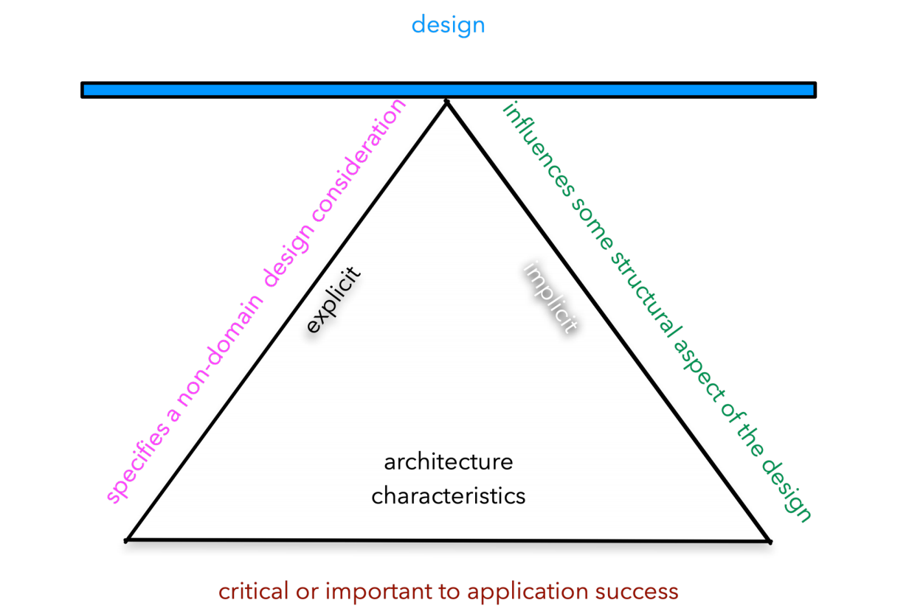
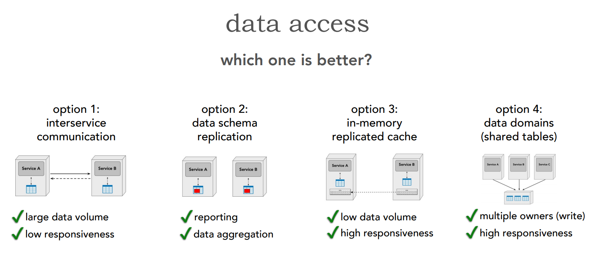

# Architecture the Hard Part

This is a collection of notes and important stuff I took away from the lecture "Architecture: The Hard Parts - Interactive Scenarios by Neal Ford and Mark Richards".

## The two laws of Software Architecture:

1. "Everything in software architecture is a tradeoff", in its definition Software Architecture is "Decisions where each possibility features significant associated tradeoffs."
2. “Why is more important than how”

## How do I choose an appropriate architecture?

1. Identify architecture characteristics(Non-Functional requirements):
   Reliability, scalability, performance, availability, security and so on
2. Identify the scope and number of distinct architecture characteristics.

## architecture characteristics(Non-Functional requirements)

An architecture characteristics is:

- Specifies a non domain design consideration.
- influences some structural aspect of the design.
- Critical or important to application success.

There are explicit and implicit characteristics:

- Explicit, have a clear value like the number of dayly users that we want to support.
- Implicit, are characteristics that need to be in the design althought they don't have a clear value, for example security or

### Difficulties in architecture characteristics(Non-Functional requirements):

- Synergistic, the architecture characteristics effect each other, for example inhencing security could cause a performance problem - you need to find the currect balance between them.
- Ill-defined, in most companies the architecture characteristics are not well defined and within an organization people may think that an architecture characteristic means different things, so it is important to give a clear definition to each characteristic.
- Voluminous, anything can be a characteristic, creating to many of them can lead to confusion.
- Numerous categories.

### Operational Architecture Characteristics

- Performance
- Scalability - the ability to handle a large number of requests.
- Elasticity - the ability to handle a sudden burst of new requests.
- Reliability (composite) - the ability of a system or component to function under stated conditions for a specified period of time. Reliability is a composite meaning you can break it down into measurable characteristics like availability for example which has a clear way to measure:

## Architectural Quantum

An independently deployable artifact with high functional cohesion, high static coupling, & synchronous dynamic coupling.

dynamic coupling - Is when 2 different parts of a system are talking and dependent of each other. For example in a microservices architecture if service 1 calls service 2 synchronously then as long as that call lasts they are dynamically coupled.

### How do I determine the appropriate level of granularity?

#### Service Granularity

##### Granularity Disintegrators

“when should I consider breaking apart a service?“

- Service Functionality (single purpose)
- Code volatility - How frequently does the code change?
- Scalability and Throughput:
  - How much requests each part is getting per minute?
  - How much time does it take for a part to scale?
- Fault Tolerance - does a specific part of the service can/while crash more then other parts of the service?
- Data Security: in many cases you will need to secure specific information within a service, for example if you are saving the credit card information of a customer. Even if the location the data is saved(DB) is secured enough, the access points to the service will be the same, breaking a service into micro services to restrict access points is a way to achieve that isolation.

##### Granularity Integrators

“when should I consider putting services back together?”

- Data transaction - when you break up a service you no langer have an ACID transaction. If there is a requirement that the data will exist in both tables all the time then you can't break it into two separate tables.
- Data Dependencies - When working with multiple services they often will work against the same DB instance. If a couple of services use (read or write) the same DB tables then a service A can break because service B changed something in a table that they are both using.
- Workflow and Choreography - If services are talking to each other and dependent of each other this could lead to a hit in:
  - Performance - each time a service is talking to a different service there is a network, security and data latency that we should take into consideration, if the latency is to big this could lead to a hit in performance.
  - Fault tolerance - if there are dependencies between the services then once one of them is down for any reason then the other parts are also down.

## How do I choose between choreography and orchestration for my workflow?

First of all some definitions:

- Orchestration - is like an orchestra, we have one component which is the conductor and it is telling the rest what to do.
- Choreography - is like a dance, all the components are talking to each other.

## How do I create systems with high semantic coupling but low syntactic coupling?

### contract considerations - strict vs. loose contracts

## Data Access

### Option 1: Interservice communication**

Service 1 asks the data it wants from Service 2

-Network, Security and Data Latency
-scalability and throughput
-fault tolerance(dependencies)

### Option 2: Data Replication

All the data Service 1 needs is replicated to Service 1 table

+Network, Security and Data Latency
+scalability and throughput
+fault tolerance(dependencies)
-Data consistency issues
-Data ownership issues

### Option 3: In-Memory replicated cache

Service 1 have a read-only replicated cache containing the data it needs from Service 2 cache.

+Network, Security and Data Latency
+scalability and throughput
+fault tolerance(dependencies)
+Data consistency issues
+Data ownership issues
-eventually consistent
-data volume issues (how do you save 16TB in memory?)
-update rate issues

### Option 4: Data domain

Both services share the same data

+Network, Security and Data Latency
+scalability and throughput
+fault tolerance(dependencies)
+Data consistency issues
+Data ownership issues
+eventually consistent
+data volume issues (how do you save 16TB in memory?)
+update rate issues
-change control
-data ownership(read/write/responsibility)
-broader bounded context

## How do I achieve high levels of scalability and elasticity in a system?

- Event Driven Architecture:

  + High performance and scale
  - Very complex for simple things(instancing, discovery, etc)
  - Traditional headaches of message-based systems
  - granularity issues with elasticity
  - too much build it yourself

- Space Based Architecture:
   + 
- Microservices Architecture:
   + Scalabiliry achieved via sevice discovery + serivce mesh + orchestration.
   + follows current trends
   + domain partitioned; low(est) incidental coupling
   + extremelty good MTTS(mean to time startup)
   - Architects must build transactional behavior

PDF SLIDES LINK: https://on24static.akamaized.net/event/30/53/36/7/rt/1/documents/resourceList1618254167890/architecturethehardpartsscenarios202105031619730397570.pdf