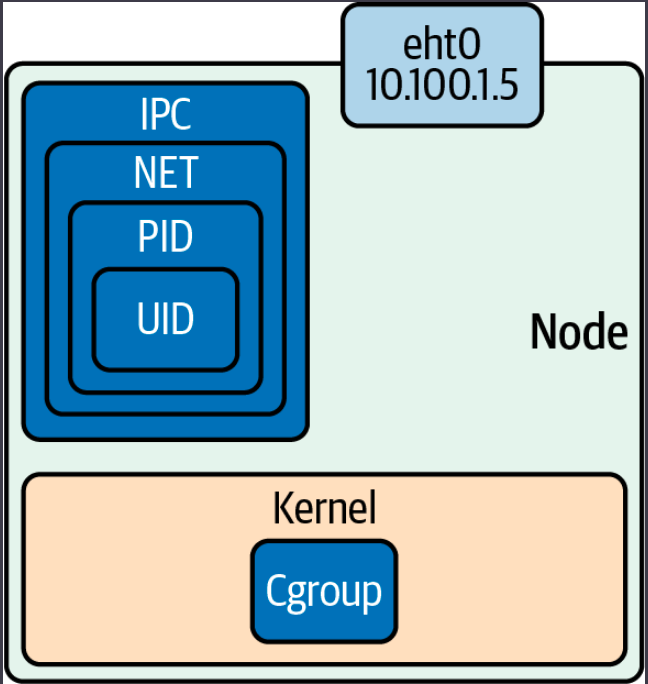
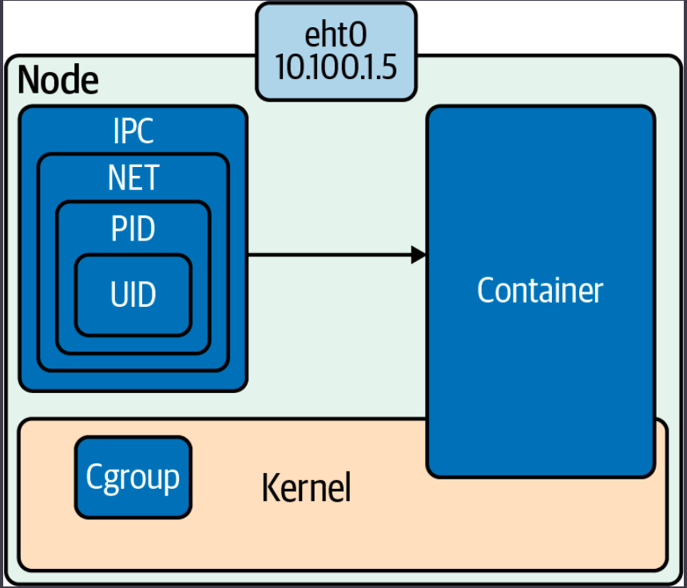
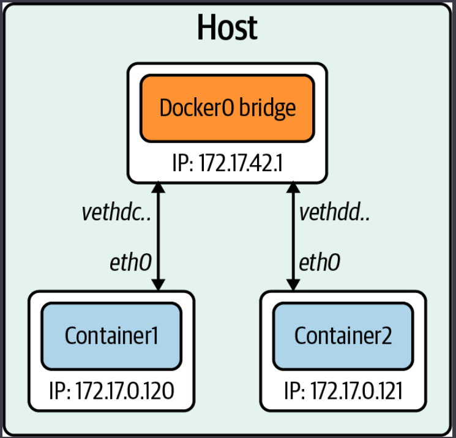
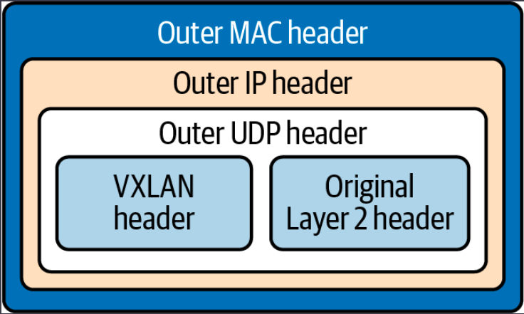
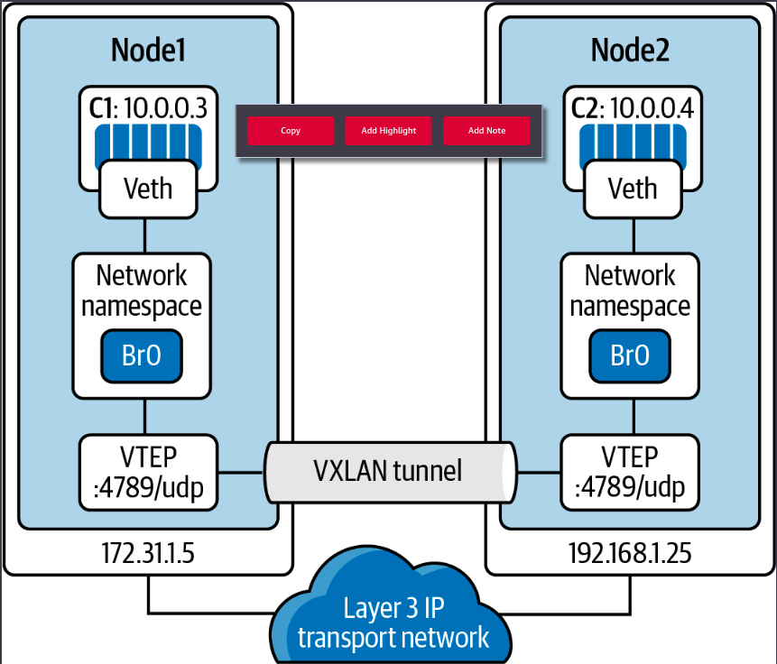
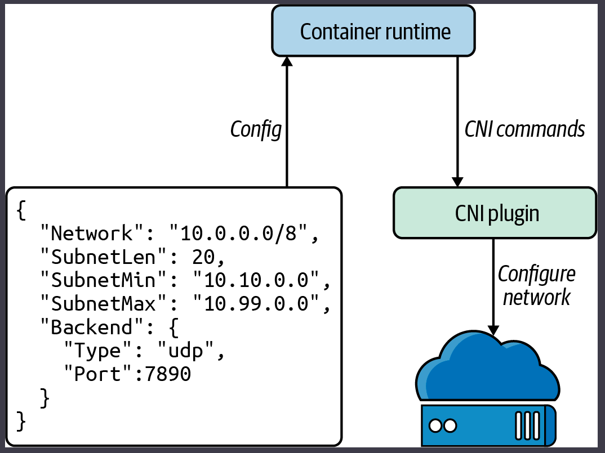

# Container Networking Basics

Before we get started, some terms we need to know:

- **Container** - A running container image.
- **Image** - A container image is the file that is pulled down from a registry server and used locally as a mount point when starting a container.
- **Container engine** - A container engine accepts user requests via command-line options to pull images and run a container.
- **Container runtime** - The container runtime is the low-level piece of software in a container engine that deals with running a container.
- **Base image** - A starting point for container images; to reduce build image sizes and complexity, users can start with a base image and make incremental changes on top of it.
- **Image layer** - Repositories are often referred to as images or container images, but actually they are made up of one or more layers. Image layers in a repository are connected in a parent-child relationship. Each image layer represents changes between itself and the parent layer.
- **Image format** - Container engines have their own container image format, such as LXD, RKT, and Docker.
- **Registry** - A registry stores container images and allows for users to upload, download, and update container images.
- **Repository** - Repositories can be equivalent to a container image. The important distinction is that repositories are made up of layers and metadata about the image; this is the manifest.
- **Tag** - A tag is a user-defined name for different versions of a container image.
- **Container host** - The container host is the system that runs the container with a container engine.
- **Container orchestration** - This is what Kubernetes does! It dynamically schedules container workloads for a cluster of container hosts.

## Container Primitives

No matter if you are using Docker or containerd, runC starts and manages the actual containers for them. In this section, we will review what runC takes care of for developers from a container perspective. Each of our containers has Linux primitives known as control groups and namespaces.
Cgroups control access to resources in the kernel for our containers, and namespaces are individual slices of resources to manage separately from the root namespaces, i.e., the host.



### Control Groups

In short, a cgroup is a Linux kernel feature that limits, accounts for, and isolates resource usage. Cgroups allow administrators to control different CPU systems and memory for particulate processes. Cgroups are provided through pseudofilesystems and are maintained by the core kernel code in cgroups.
These separate subsystems maintain various cgroups in the kernel:

- CPU: The process can be guaranteed a minimum number of CPU shares.
- Memory: These set up memory limits for a process.
- Disk I/O: This and other devices are controlled via the device’s cgroup subsystem.
- Network: This is maintained by the net_cls and marks packets leaving the cgroup.

lscgroup is a command-line tool that lists all the cgroups currently in the system.

runC will create the cgroups for the container at creation time. A cgroup controls how much of a resource a container can use, while namespaces control what processes inside the container can see.

### Namespaces

Namespaces are features of the Linux kernel that isolate and virtualize system resources of a collection of processes. Here are examples of virtualized resources:

- PID namespace - Processes ID, for process isolation
- Network namespace: Manages network interfaces and a separate networking stack
- IPC namespace: Manages access to interprocess communication (IPC) resources
- Mount namespace: Manages filesystem mount points
- UTS namespace: UNIX time-sharing; allows single hosts to have different host and domain names for different processes.
- UID namespaces: User ID; isolates process ownership with separate user and group assignments

A process’s user and group IDs can be different inside and outside a user’s namespace. A process can have an unprivileged user ID outside a user namespace while at the same time having a user ID of 0 inside the container user namespace. The process has root privileges for execution inside the user namespace but is unprivileged for operations outside the namespace.

Example of how to inspect the namespaces for a process. All information for a process is on the /proc filesystem in Linux. PID 1’s PID namespace is 4026531836, and listing all the namespaces shows that the PID namespace IDs match.

```
vagrant@ubuntu-xenial:~$ sudo ps -p 1 -o pid,pidns
  PID      PIDNS
    1 4026531836

vagrant@ubuntu-xenial:~$ sudo ls -l /proc/1/ns
total 0
lrwxrwxrwx 1 root root 0 Dec 12 20:41 cgroup -> cgroup:[4026531835]
lrwxrwxrwx 1 root root 0 Dec 12 20:41 ipc -> ipc:[4026531839]
lrwxrwxrwx 1 root root 0 Dec 12 20:41 mnt -> mnt:[4026531840]
lrwxrwxrwx 1 root root 0 Dec 12 20:41 net -> net:[4026531957]
lrwxrwxrwx 1 root root 0 Dec 12 20:41 pid -> pid:[4026531836]
lrwxrwxrwx 1 root root 0 Dec 12 20:41 user -> user:[4026531837]
lrwxrwxrwx 1 root root 0 Dec 12 20:41 uts -> uts:[4026531838]
```

Cgroups and Namespaces allow application developers to control and manage their applications separate from the hosts and other applications either in containers or by running natively on the host.



## Container Network Basics
 
Network “modes” in containers:

- **None:** No networking disables networking for the container. Use this mode when the container does not need network access.

- **Bridge:** In bridge networking, the container runs in a private network internal to the host. Communication with other containers in the network is open. Communication with services outside the host goes through Network Address Translation (NAT) before exiting the host. Bridge mode is the default mode of networking when the --net option is not specified.

- **Host:** In host networking, the container shares the same IP address and the network namespace as that of the host. Processes running inside this container have the same network capabilities as services running directly on the host. This mode is useful if the container needs access to network resources on the hosts. The container loses the benefit of network segmentation with this mode of networking. Whoever is deploying the containers will have to manage and contend with the ports of services running this node.

- **Macvlan:** Macvlan uses a parent interface. That interface can be a host interface such as eth0, a subinterface, or even a bonded host adapter that bundles Ethernet interfaces into a single logical interface. Like all Docker networks, Macvlan networks are segmented from each other, providing access within a network, but not between networks. Macvlan allows a physical interface to have multiple MAC and IP addresses using Macvlan subinterfaces. Macvlan has four types: Private, VEPA, Bridge (which Docker default uses), and Passthrough. With a bridge, use NAT for external connectivity. With Macvlan, since hosts are directly mapped to the physical network, external connectivity can be done using the same DHCP server and switch that the host uses.
** Most cloud providers block Macvlan networking. Administrative access to networking equipment is needed.

- **IPvlan**: IPvlan is similar to Macvlan, with a significant difference: IPvlan does not assign MAC addresses to created subinterfaces. All subinterfaces share the parent’s interface MAC address but use different IP addresses. IPvlan has two modes, L2 or L3. In IPvlan, L2, or layer 2, mode is analog to the Macvlan bridge mode. IPvlan L3, or layer 3, mode masquerades as a layer 3 device between the subinterfaces and parent interface.

- **Overlay**: Overlay allows for the extension of the same network across hosts in a container cluster. The overlay network virtually sits on top of the underlay/physical networks. Several open source projects create these overlay networks, which we will discuss later in the chapter.
- **Custom**: Custom bridge networking is the same as bridge networking but uses a bridge explicitly created for that container. An example of using this would be a container that runs on a database bridge network. A separate container can have an interface on the default and database bridge, enabling it to communicate with both networks as needed.

### Docker Networking Model

Libnetwork is Docker’s take on container networking, and its design philosophy is in the container networking model (CNM). Libnetwork implements the CNM and works in three components, the sandbox, endpoint, and network:
- The sandbox implements the management of the **Linux network namespaces** for all containers running on the host.
- The network component is a collection of endpoints on the same network.
- Endpoints are hosts on the network.

The network controller manages all of this via APIs in the Docker engine.
On the endpoint, Docker uses iptables for network isolation. The container publishes a port to be accessed externally. Containers do not receive a public IPv4 address; they receive a private RFC 1918 address. Services running on a container must be exposed port by port, and container ports have to be mapped to the host port so conflicts are avoided. When Docker starts, it creates a virtual bridge interface, docker0, on the host machine and assigns it a random IP address from the private 1918 range. This bridge passes packets between two connected devices, just like a physical bridge does. Each new container gets one interface automatically attached to the docker0 bridge;



Bridge networks are for containers running on the same host. Communicating with containers running on different hosts can use an overlay network.

### Overlay Networking

For applications running in containers on separate nodes to communicate, several issues need to be solved, such as how to coordinate routing information between hosts, port conflicts, and IP address management.
One technology that helps with routing between hosts for containers is a VXLAN.
A VXLAN is an extension of the VLAN protocol creating 16 million unique identifiers.
A VXLAN packet is a MAC-in-UDP encapsulated packet. The layer 2 frame has a VXLAN header added to it and is placed in a UDP-IP packet. The VXLAN identifier is 24 bits. That is how a VXLAN can support 16 million segments.



In the diagram bellow we can see how a VXLAN tunnel looks like. We have the VXLAN tunnel endpoints, VTEPs, on both hosts, and they are attached to the host’s bridge interfaces with the containers attached to the bridge. The VTEP performs data frame encapsulation and decapsulation. The VTEP peer interaction ensures that the data gets forwarded to the relevant destination container addresses. The data leaving the containers is encapsulated with VXLAN information and transferred over the VXLAN tunnels to be de-encapsulated by the peer VTEP.



Overlay networking enables cross-host communication on the network for containers.

## Container Network Interface (CNI)

CNI is the software interface between the container runtime and the network implementation. The CNI project consists of a specification and libraries for developing plugins to configure network interfaces in Linux containers. CNI is concerned with a container’s network connectivity by allocating resources when the container gets created and removing them when deleted. A CNI plugin is responsible for associating a network interface to the container network namespace and making any necessary changes to the host. It then assigns the IP to the interface and sets up the routes for it.
The container runtime uses a configuration file for the host’s network information; in Kubernetes, the Kubelet also uses this configuration file. The CNI and container runtime communicate with each other and apply commands to the configured CNI plugin.



There are several open source projects that implement CNI plugins with various features and functionality. Here is an outline of several:

- **Cilium**: Cilium is open source software for securing network connectivity between application containers. Cilium is an L7/HTTP-aware CNI and can enforce network policies on L3–L7 using an identity-based security model decoupled from network addressing. A Linux technology eBPF powers it.

- **Flannel**: Flannel is a simple way to configure a layer 3 network fabric designed for Kubernetes. Flannel focuses on networking. Flannel uses the Kubernetes cluster’s existing etcd datastore to store its state information to avoid providing a dedicated one.

- **Calico**: According to Calico, it “combines flexible networking capabilities with run-anywhere security enforcement to provide a solution with native Linux kernel performance and true cloud-native scalability.” It has full network policy support and works well in conjunction with other CNIs. Calico does not use an overlay network. Instead, Calico configures a layer 3 network that uses the BGP routing protocol to route packets between hosts. Calico can also integrate with Istio, a service mesh, to interpret and enforce policy for workloads within the cluster, both at the service mesh and the network infrastructure layers.

- **AWS VPC**: AWS has its open source implementation of a CNI, the AWS VPC CNI. It provides high throughput and availability by being directly on the AWS network. There is low latency using this CNI by providing little overhead because of no additional overlay network and minimal network jitter running on the AWS network. Cluster and network administrators can apply existing AWS VPC networking and security best practices for building Kubernetes networks on AWS. They can accomplish those best practices because the AWS CNI includes the capability to use native AWS services like VPC flow logs for analyzing network events and patterns, VPC routing policies for traffic management, and security groups and network access control lists for network traffic isolation.

There are many more options for a CNI, and it is up to the cluster administrator, network admins, and application developers to best decide which CNI solves their business use cases.
