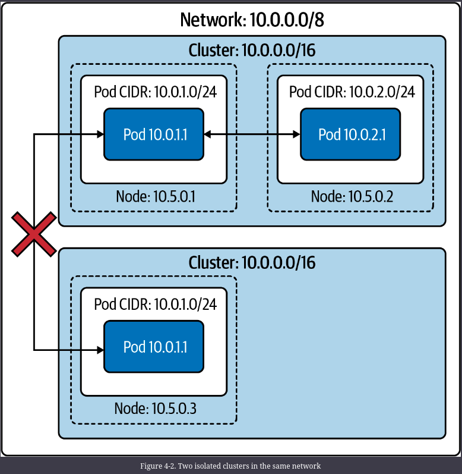
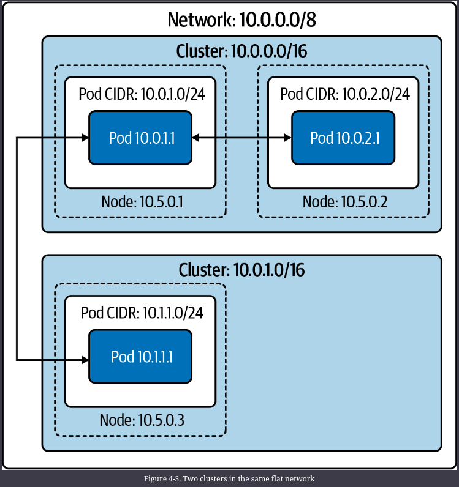
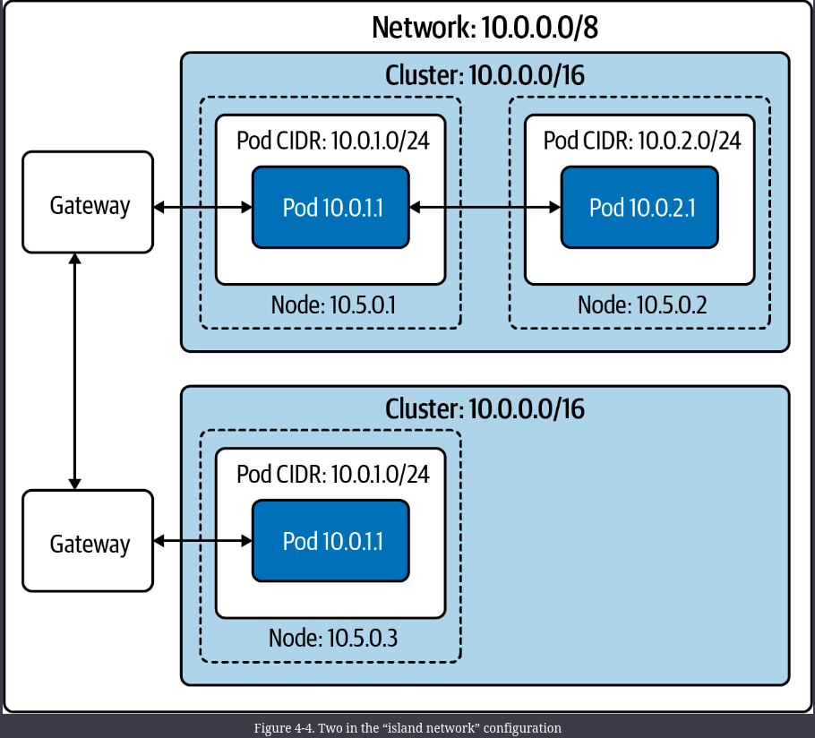

# Kubernetes Networking Introduction

Kubernetes networking looks to solve these four networking issues:

- Highly coupled container-to-container communications.
- Pod-to-pod communications.
- Pod-to-service communications.
- External-to-service communications

## Kubernetes Networking Model

The Kubernetes networking model natively supports multihost cluster networking. Pods can communicate with each other by default, regardless of which host they are deployed on. Kubernetes relies on the CNI project to comply with the following requirements:

- All containers must communicate with each other without NAT.
- Nodes can communicate with containers without NAT.
- A container’s IP address is the same as those outside the container that it sees itself as.

The unit of work in Kubernetes is called a pod. A pod contains one or more containers, which are always scheduled and run “together” on the same node. This connectivity allows individual instances of a service to be separated into distinct containers. For example, a developer may choose to run a service in one container and a log forwarder in another container. Running processes in distinct containers allows them to have separate resource quotas (e.g., “the log forwarder cannot use more than 512 MB of memory”). It also allows container build and deployment machinery to be separated by reducing the scope necessary to build a container.

A pod has a unique IP address, which is shared by all containers in the pod. The primary motivation behind giving every pod an IP address is to remove constraints around port numbers. In Linux, only one program can listen on a given address, port, and protocol. If pods did not have unique IP addresses, then two pods on a node could contend for the same port. Unfortunately for us, allocating and routing an IP address for every pod adds substantial complexity to a Kubernetes cluster.

Every Kubernetes node runs a component called the Kubelet, which manages pods on the node. The networking functionality in the Kubelet comes from API interactions with a CNI plugin on the node. The CNI plugin is what manages pod IP addresses and individual container network provisioning. The CNI plugin is responsible for assigning pod IP addresses and maintaining a route between all (applicable) pods. Kubernetes does not ship with a default CNI plugin, which means that in a standard installation of Kubernetes, pods cannot use the network.

## Node and Pod Network Layout

The cluster must have a group of IP addresses that it controls to assign an IP address to a pod, for example, 10.1.0.0/16. Nodes and pods must have L3 connectivity in this IP address space. Generally, pods do not have MAC addresses. Therefore, L2 connectivity to pods is not possible. The CNI will determine this for pods.
There are no requirements in Kubernetes about L3 connectivity to the outside world. Although the majority of clusters have internet connectivity, some are more isolated for security reasons.
There are broadly three approaches, with many variations, to structuring a cluster’s network: isolated, flat, and island networks.

### Isolated Networks

In an isolated cluster network, nodes are routable on the broader network (i.e., hosts that are not part of the cluster can reach nodes in the cluster), but pods are not.
Because the cluster is not routable from the broader network, multiple clusters can even use the same IP address space. Many managed Kubernetes providers have a “secure cluster” option like this, where no direct traffic is possible between the cluster and the internet.
That isolation to the local cluster can be splendid for security if the cluster’s workloads permit/require such a setup, such as clusters for batch processing. However, it is not reasonable for all clusters. The majority of clusters will need to reach and/or be reached by external systems, such as clusters that must support services that have dependencies on the broader internet. Load balancers and proxies can be used to breach this barrier and allow internet traffic into or out of an isolated cluster.

### Flat Networks

In a flat network, all pods have an IP address that is routable from the broader network. Barring firewall rules, any host on the network can route to any pod inside or outside the cluster. This configuration has numerous upsides around network simplicity and performance. Pods can connect directly to arbitrary hosts in the network.
Because the broader network can route every pod IP address to that pod’s node, any host on the network is reachable to and from any pod.

External pod traffic has low latency and low overhead. Any form of proxying or packet rewriting causes a latency and processing cost, which is small but nontrivial.
Unfortunately, this model requires a large, contiguous IP address space for each cluster (i.e., a range of IP addresses where every IP address in the range is under your control). Kubernetes requires a single CIDR for pod IP addresses (for each IP family). This model is achievable with a private subnet (such as 10.0.0.0/8 or 172.16.0.0/12); however, it is much harder and more expensive to do with public IP addresses, especially IPv4 addresses. Administrators will need to use NAT to connect a cluster running in a private IP address space to the internet.
Flat networks, on a private subnet, are easy to achieve in a cloud provider environment. The vast majority of cloud provider networks will provide large private subnets and have an API (or even preexisting CNI plugins) for IP address allocation and route management.

### Island Networks

Island cluster networks are, at a high level, a combination of isolated and flat networks.
In an island cluster setup nodes have L3 connectivity with the broader network, but pods do not. Traffic to and from pods must pass through some form of proxy, through nodes. Most often, this is achieved by iptables source NAT on a pod’s packets leaving the node. This setup, called masquerading, uses SNAT to rewrite packet sources from the pod’s IP address to the node’s IP address. In other words, packets appear to be “from” the node, rather than the pod.
Sharing an IP address while also using NAT hides the individual pod IP addresses. IP address–based firewalling and recognition becomes difficult across the cluster boundary. Within a cluster, it is still apparent which IP address is which pod.
Pods in other clusters, or other hosts on the broader network, will no longer have that mapping. IP address-based firewalling and allow lists are not sufficient security on their own but are a valuable and sometimes required layer.

### kube-controller-manager Configuration

*** Control plane refers to all the functions and processes that determine which path to use to send the packet or frame.
*** Data plane refers to all the functions and processes that forward packets/frames from one interface to another based on control plane logic.

The kube-controller-manager runs most individual Kubernetes controllers in one binary and one process, where most Kubernetes logic lives. At a high level, a controller in Kubernetes terms is software that watches resources and takes action to synchronize or enforce a specific state.

KCM has a number of network related flags:

- --allocate-node-cidrs(true): Sets whether CIDRs for pods should be allocated and set on the cloud provider.

- --CIDR-allocator-type string (RangeAllocator): Type of CIDR allocator to use.

- --cluster-CIDR: CIDR range from which to assign pod IP addresses. Requires "--allocate-node-cidrs" to be true. If kube-controller-manager has IPv6DualStack enabled, "--cluster-CIDR" accepts a comma-separated pair of IPv4 and IPv6 CIDRs.

- --configure-cloud-routes(true): Sets whether CIDRs should be allocated by allocate-node-cidrs and configured on the cloud provider.

- --node-CIDR-mask-size(24 for IPv4 clusters, 64 for IPv6 clusters): Mask size for the node CIDR in a cluster. Kubernetes will assign each node 2^(node-CIDR-mask-size) IP addresses.

- --node-CIDR-mask-size-ipv4(24): Mask size for the node CIDR in a cluster. Use this flag in dual-stack clusters to allow both IPv4 and IPv6 settings.

- --node-CIDR-mask-size-ipv6(64): Mask size for the node CIDR in a cluster. Use this flag in dual-stack clusters to allow both IPv4 and IPv6 settings.

- --service-cluster-ip-range: CIDR range for services in the cluster to allocate service ClusterIPs. Requires --allocate-node-cidrs to be true. If kube-controller-manager has IPv6DualStack enabled, --service-cluster-ip-range accepts a comma-separated pair of IPv4 and IPv6 CIDRs.

## Pod Readiness and Probes

Pod readiness is an additional indication of whether the pod is ready to serve traffic. Pod readiness determines whether the pod address shows up in the Endpoints object from an external source. Other Kubernetes resources that manage pods, like deployments, take pod readiness into account for decision-making, such as advancing during a rolling update.

Users can specify pod readiness checks in the pod spec. From there, the Kubelet executes the specified check and updates the pod status based on successes or failures.

Probes effect the .Status.Phase field of a pod. The following is a list of the pod phases and their descriptions:

- **Pending**: The pod has been accepted by the cluster, but one or more of the containers has not been set up and made ready to run. This includes the time a pod spends waiting to be scheduled as well as the time spent downloading container images over the network.

- **Running**: The  pod  has  been  scheduled  to  a  node,  and  all  the  containers  have  been  created. At least one container is still running or is in the process of starting or restarting. Note that some containers may be in a failed state, such as in a CrashLoopBackoff.

- **Succeeded**: All containers in the pod have terminated in success and will not be restarted.

- **Failed**: All containers in the pod have terminated, and at least one container has terminated in failure. That is, the container either exited with nonzero status or was terminated by the system.

- **Unknown**: For some reason the state of the pod could not be determined. This phase typically occurs due to an error in communicating with the Kubelet where the pod should be running.

The Kubelet performs several types of health checks for individual containers in a pod: 

- liveness probes (livenessProbe)
- readiness probes (readinessProbe)
- startup probes (startupProbe)

Each probe has one of three results:

- Success: The container passed the diagnostic.
- Failure: The container failed the diagnostic.
- Unknown: The diagnostic failed, so no action should be taken.
The probes can be exec probes, which attempt to execute a binary within the container, TCP probes, or HTTP probes. If the probe fails more than the failureThreshold number of times, Kubernetes will consider the check to have failed. The effect of this depends on the type of probe.

When a container’s readiness probe fails, the Kubelet does not terminate it. Instead, the Kubelet writes the failure to the pod’s status.

If the liveness probes fail, the Kubelet will terminate the container. Liveness probes can easily cause unexpected failures if misused or misconfigured. The intended use case for liveness probes is to let the Kubelet know when to restart a container.

The startupProbe will inform the Kubelet whether the application inside the container is started. This probe takes precedent over the others. If a startupProbe is defined in the pod spec, all other probes are disabled. Once the startupProbe succeeds, the Kubelet will begin running the other probes. But if the startup probe fails, the Kubelet kills the container, and the container executes its restart policy

This status does not affect the pod itself, but other Kubernetes mechanisms react to it. One key example is ReplicaSets (and, by extension, deployments). A failing readiness probe causes the ReplicaSet controller to count the pod as unready, giving rise to a halted deployment when too many new pods are unhealthy. The Endpoints/EndpointsSlice controllers also react to failing readiness probes. If a pod’s readiness probe fails, the pod’s IP address will not be in the endpoint object, and the service will not route traffic to it. 

## The CNI Specification

The CNI specification itself is quite simple. According to the specification, there are four operations that a CNI plugin must support:

- ADD: Add a container to the network.
- DEL: Delete a container from the network.
- CHECK: Return an error if there is a problem with the container’s network.
- VERSION: Report version information about the plugin.

CNI plugins frequently have very simple binaries, which act as a wrapper for Kubernetes to call, while the binary makes an HTTP or RPC API call to a persistent backend. CNI maintainers have discussed changing this to an HTTP or RPC model, based on performance issues when frequently launching Windows processes.

## CNI Plugins

The CNI plugin has two primary responsibilities:

1. Allocate and assign unique IP addresses for pods.
2. Ensure that routes exist within Kubernetes to each pod IP address.

These responsibilities mean that the overarching network that the cluster resides in dictates CNI plugin behavior. For example, if there are too few IP addresses or it is not possible to attach sufficient IP addresses to a node, cluster admins will need to use a CNI plugin that supports an overlay network. The hardware stack, or cloud provider used, typically dictates which CNI options are suitable.

There are two broad categories of CNI network models: flat networks and overlay networks.
In a flat network, the CNI driver uses IP addresses from the cluster’s network, which typically requires many IP addresses to be available to the cluster.
In an overlay network, the CNI driver creates a secondary network within Kubernetes, which uses the cluster’s network (called the underlay network) to send packets. Overlay networks create a virtual network within the cluster. In an overlay network, the CNI plugin encapsulates packets. Overlay networks add substantial complexity and do not allow hosts on the cluster network to connect directly to pods. However, overlay networks allow the cluster network to be much smaller, as only the nodes must be assigned IP addresses on that network.

### The IPAM Interface

The CNI spec has a second interface, the IP Address Management (IPAM) interface, to reduce duplication of IP allocation code in CNI plugins. The IPAM plugin must determine and output the interface IP address, gateway, and routes.

## kube-proxy

kube-proxy is another per-node daemon in Kubernetes, like Kubelet.
kube-proxy provides basic load balancing functionality within the cluster. It implements services and relies on Endpoints/EndpointSlices which list a set of ready pod IPs.
Most types of services have an IP address for the service, called the cluster IP address, which is not routable outside the cluster. kube-proxy is responsible for routing requests to a service’s cluster IP address to healthy pods.
kube-proxy is by far the most common implementation for Kubernetes services, but there are alternatives to kube-proxy, such as a replacement mode Cilium.
kube-proxy has four modes, which change its runtime mode and exact feature set:

- **userspace**: In userspace mode, kube-proxy runs a web server and routes all service IP addresses to the web server, using iptables. The web server terminates connections and proxies the request to a pod in the service’s endpoints. **userspace mode is no longer commonly used, and it is suggested to avoiding it**.

- **iptables**: iptables mode uses iptables entirely. It is the default mode, and the most commonly used. iptables mode performs connection fan-out, instead of true load balancing. In other words, iptables mode will route a connection to a backend pod, and all requests made using that connection will go to the same pod, until the connection is terminated.  It can also be unpredictable when dealing with long-lived connections, such as HTTP/2 connections

- **ipvs**: ipvs mode uses IPVS instead of iptables, for connection load balancing. ipvs mode supports six load balancing modes, specified with --ipvs-scheduler:
    - rr(default): Round-robin
    - lc: Least connection
    - dh: Destination hashing
    - sh: Source hashing
    - sed: Shortest expected delay
    - nq: Never queue

- **kernelspace**: kernelspace is the newest, Windows-only mode. It provides an alternative to userspace mode for Kubernetes on Windows, as iptables and ipvs are specific to Linux.

## NetworkPolicy

