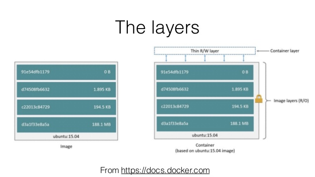

# Containerized development

## Introducing Containers

### What is a container ?

A container is just a set of processes that are running inside a certain host just like any other application would. The thing that make containers so special and relevant today is that all the processes that are running inside the container are  isolated from the rest of the system.
Containers are similar to Virtual Machines in their functionality, they also provides security, storage, resources (such as CPU and MEM) and network isolation but require far fewer hardware resources and is very quick to start and stop.
The big difference is that a virtual machine is a full OS which runs on a Hypervisor which means that most of the software that is included within the OS is not needed specificity for the application running on it, whereas a container is a process in the operating system which runs on a Container Engine.
There are many container engines available the most popular one is Docker but there is also Podman, Rocket and many more.


### Container Images

Essentially a container is a set of process with restrictions. However, instead of running a single binary file, a container runs an image. The container image is the building block of the container, just like a running process needs an executable file, a container needs an image.
An image is a file system bundle providing all application files, libraries, and dependencies the application needs to run. All of that is stored in a single file, that the container engine uses to create and start the container.
The container image is just a file so it can be managed locally or with git, but usually they are stored and maintained in an image registry.
An image registry a service that provides downloadable container images.
It can be public or private, and it allows image creators to store and distribute container images.
There are many different image repositories available, some of the most popular ones:

- [Docker Hub](https://hub.docker.com/)
- [Red Hat Container Catalog](https://catalog.redhat.com/software/containers/explore)
- [Red Hat Quay](https://quay.io/repository/)
- [Google Container Registry](https://cloud.google.com/container-registry/)
- [Amazon Elastic Container Registry](https://aws.amazon.com/ecr/)

You can browse those image repositories in your browser but you can also use the CLI:

```bash
docker search fedora
INDEX               NAME     
fedoraproject.org   registry.fedoraproject.org/f29/fedora-toolbox
fedoraproject.org   registry.fedoraproject.org/f30/fedora-toolbox
fedoraproject.org   registry.fedoraproject.org/f31/fedora-toolbox
fedoraproject.org   registry.fedoraproject.org/fedora
```

When we found a image we need to pull it locally so we can start it, for example:

```bash
docker pull registry.fedoraproject.org/f31/fedora-toolbox

docker images
```

Container images are named based on the following syntax:

registry_name/user_name/image_name:tag

- registry_name - FQDN or name of the registry storing the image.
- user_name - User or organization the image belongs to.
- image_name - Unique name in user namespace.
- tag - Image version or version identifier.

### Working with containers

Here we will show some example of the basic commands that the container engine provides us to interact with containers. In all of those examples I use docker container engine, simply because it is the most popular container engine.

#### Running Containers

The docker run command runs a container locally based on an image.  If the container image is not available locally, it tries to download the image from configured image repositories.

```bash
docker run ubi8/ubi:8
```

But if you run it like that then the container will actually exit immediately most of the times, why is that? well that is one of the most frequently asked questions when starting with containers. The reason is that the container image specifies a process that starts inside the container known as the entry point. The entry point is usually some executable or a script, but most base images will just run a simple command like /bin/bash and exit by default.

To set the entry point we can just write it after the image:

```bash
docker run ubi7/ubi:7.7 echo "Hello world

Hello world
```

The container will run as the current process, most of the times we would like it to run in the background, especially if this is a process that runs until it is stopped like an http server.
To start the container in the background use the -d option:

```bash
# Run Apache HTTP Server in the background
docker run -d docker.io/library/httpd
12c773fb4d336fd503ba613572fdeb24ef27fd82099b8eeb5961236652dac535
```

This will start the container in the background but we will not be able to access the server from our host, this is because the container network is isolated and we can't reach it from the host by default. To overcome this we need to define port forwarding rules to expose a certain container port and allow external access to a container service.

Use the -p [<IP address>:][<host port>:]<container port> option

```bash
# Run Apache HTTP Server in the background and map the container port 80 to 8080
docker run -d -p 8080:80 docker.io/library/httpd
12c773fb4d336fd503ba613572fdeb24ef27fd82099b8eeb5961236652dac535

curl http://localhost:8080
<html><body><h1>It works!</h1></body></html>
```

In the above example we see that when the container was created we received a generated uuid for it, we can use this id to refer to the running container but using an id is not user friendly. We can use the --name option to set the container name.

Some containers need external parameters when they start. The most common approach is to provide environment variables for the container. To provide environment variables to containers we use the -e flag:

```bash
docker run --name some-mysql -e MYSQL_ROOT_PASSWORD=my-secret-pw -d mysql:latest
```

Some containers need to run as an interactive shell or process, for example containers that need user input.The -it options lets us run an interactive session:

```bash
docker run -it run ubi7/ubi:7.7 /bin/bash
 bash-4.2#
```

There are many more flags and options we can give to the docker run command, but the above should get you started, to see all the options available read the documention or use the docker run --help command.

#### Running Commands in a Container

When a container starts, it executes the entry point command. But sometimes we need to execute other commands in a running container.
For example we want to see the content of the configuration file on our httpd container:

```bash
docker run -d --name my-apache -p 8080:80 docker.io/library/httpd:latest
docker exec -it my-apache cat /usr/local/apache2/conf/httpd.conf
```

#### Viewing containers

To view all the running containers we use the docker ps command:

```bash
docker ps
CONTAINER ID  IMAGE      COMMAND             CREATED  STATUS   PORTS    NAMES
6baf3d8f3919  ...httpd:2.4  httpd-foreground  2 h...  Up 2 h.. 8080...  my-apache
```

It displays the uuid and name of the running container, as well as inforation about the container itself like thje command which is running and the status of the container.

When we stop a container or a container has finished it is still available but just not running. To view all the available containers we add the -a flag.

```bash
docker stop my-apache
6baf3d8f391983c05ecc158079fb9ebf4273a24916f8c52e9b3f3001c7c5323a

docker ps
CONTAINER ID  IMAGE   COMMAND  CREATED  STATUS  PORTS   NAMES

docker ps -a
CONTAINER ID  IMAGE      COMMAND   CREATED  STATUS     PORTS    NAMES
6baf3d8f3919  httpd:2.4  httpd-... 2 hours  Exited (0) 0.0.0.   my-apache
```

#### Getting information about a container

To get information about the metadata of the container we use the inspect command:

```bash
docker inspect my-apache
[
    {
        "Id": "6baf3d8f391983c05ecc158079fb9ebf4273a24916f8c52e9b3f3001c7c5323a",
        "Created": "2020-08-09T11:45:39.20105865+03:00",
        "Path": "httpd-foreground",
        "Args": [
            "httpd-foreground"
        ],
        "State": {
            "OciVersion": "1.0.2-dev",
            "Status": "exited",
            "Running": false,
            "Paused": false,
....
```

To filter the very verbose output use the -f command:

```bash
docker inspect my-apache -f '{{ .NetworkSettings.Ports }}'

map[80/tcp:[{ 8080}]]
```

#### Stopping a container

To stop a running container the regular way we use the stop command:

```bash
docker stop my-apache
6baf3d8f391983c05ecc158079fb9ebf4273a24916f8c52e9b3f3001c7c5323a
```

Another way of stopping a container is to use the docker kill command

```bash
docker kill my-apache
6baf3d8f391983c05ecc158079fb9ebf4273a24916f8c52e9b3f3001c7c5323a
```

The difference is that stop send SIGTERM, and then SIGKILL after grace period and kill sends a send SIGKILL or a different signal if specified with the --signal flag.
For 99% of the times you will stop with docker stop, but kill is useful when you want to send a specific signal to the process, for example freezing a running container with sig STOP

```bash
docker kill -s SIGSTOP my-apache
6baf3d8f391983c05ecc158079fb9ebf4273a24916f8c52e9b3f3001c7c5323a

docker ps
CONTAINER ID    IMAGE     COMMAND    CREATED    STATUS     PORTS   NAMES
...

docker kill -s SIGCONT my-apache
Emulate Docker CLI using podman. Create /etc/containers/nodocker to quiet msg.
6baf3d8f391983c05ecc158079fb9ebf4273a24916f8c52e9b3f3001c7c5323a
```

see the list of signals [here](https://man7.org/linux/man-pages/man7/signal.7.html).

#### Removing a container

To completely remove a container use the rm command:

```bash
docker stop my-apache
6baf3d8f391983c05ecc158079fb9ebf4273a24916f8c52e9b3f3001c7c5323a

docker rm my-apache
6baf3d8f391983c05ecc158079fb9ebf4273a24916f8c52e9b3f3001c7c5323a
```

### Persistent Storage to Containers

Usually (by default) container storage is not preserved after the container has been removed. This is consistent with the assumption that a container is an isolated environment that always start with a clean and empty storage, and this makes creating and destroying containers relatively fast.

As I said in the beginning a container image is composed of layers, when we run a new container it gets a new layer over the base image - the storage layer.
At first, this layer is the only read/write storage available for the container, it can't be shared and it is used to create all the files that the container needs.
This ensures the each container's resources are isolated from other containers.



That is probably good for most use cases, but not for all. Some applications need to keep their data between reboots or share storage with other applications, the most straight forward example is a database.

We can't use the existing storage layer as a persistent storage volume because:

- We cannot control how long its contents will be preserved.
- The storage layer file system does not perform well for intensive I/O workloads such as databases.

So we need to mount an external volume. The external volume will come from the host of the container, we can mount host directories inside the running container, those directories can then be mounted to new containers whenever needed.

For example, a MySQL database container can use a host directory to store database files. If this database container fails, the container engine can create a new container using the same host directory, keeping the database data available to client applications.

A container runs as a host system process, under a host operating system user and group, so the host directory needs to be configured with ownership and permissions allowing access to the container. In RHEL, the host directory also needs to be configured with the appropriate SELinux context, which is container_file_t.

To set up the host directory:

```bash

# Create a directory with owner and group root:
sudo mkdir /var/dbfiles 

# Set the uid and gid to the container user
sudo chown -R 27:27 /var/dbfiles

# Set SELinux context to the directory..
sudo semanage fcontext -a -t container_file_t '/var/dbfiles(/.*)?'
sudo restorecon -Rv /var/dbfiles 

# Run the container with the mounted Volume
sudo podman run -v /var/dbfiles:/var/lib/mysql rhmap47/mysql

# Note:
# The host directory must be configured before starting the container that uses the directory.
```

## Containerized Applications

When we develop we usually run the program on our own machine or inside a virtual machine. Usually our software will have dependencies such as OS, libraries, binaries, tools and services, certain configuration and much more.
The traditional approach has two big drawbacks:

- Tightly coupled to the runtime environment (OS) - The program may break when certain updates are applied to the OS, this can lead to complex exclusions of packages or even avoiding updating the OS which can lead to security issues.
- Downtime - When we update the application dependencies usually the application needs to be stopped or the OS needs to be rebooted, Which makes it hard to keep the system highly available.

Containerized Applications, are applications that are deployed using a container
The use of containers not only helps with the efficiency, elasticity, and reusability of the hosted applications, but also with application portability.

Lets sum up some of the major advantages of using containers:

- **Lower resources usage:**

    Containers use OS internal features called namespaces and cgroups to create an isolated environment and dedicated resources. This approach minimizes the amount of CPU and memory overhead compared to a virtual machine hypervisor.

- **Environment isolation and Multiple environments:**

    Containers work in an isolated environment, changes that are made to the underlying OS or other containers doesn't affect the container. When we use containers all the dependencies and environment settings are encapsulated within the container image making it possible to run multiple different environments on the same host.

- **Quick deployment:**

    Containers build, start and stop very fast compared to a VM because there is no need to install/start/stop the entire underlying operating system.

- **Decoupling:**

    When we develop a containerized application each container has one job, for example one container can run the DB, another can run a certain backed microservice and another can run the frontend.

## Deep dive into the rabbit hole

So now that we understand what is a container and what are the benefits of using it, we will review a bit of the **How?**
Container revolve around one basic concept:

```txt
Enabling processes to run isolated while still accessing system resources.
```

To provide that isolated environment container technologies make use of a few important security features in the Linux kernel:

- **Namespaces**:

    Namespaces allow the kernel to isolate specific system resources, usually visible to all processes, by placing those resources within a namespace. Only the processes that are in the namespace can see those resources. Namespaces can include resources like network interfaces, the process ID list, mount points, IPC resources, and the system's host name information.

- **Control groups (cgroups):**

    Control groups allows us to manage and limit a certain amount of resources to a group of processes. Those limits keep one process from using too many resources on the host.

- **Seccomp:**

    Seccomp limits how processes could use system calls. Seccomp defines a security profile for processes, whitelisting the system calls, parameters and file descriptors they are allowed to use.

- **SELinux (Security-Enhanced Linux):**

    SELinux is a mandatory access control system for processes. Linux kernel uses SELinux to protect processes from each other and to protect the host system from its running processes. Processes run as a confined SELinux type that has limited access to host system resources.