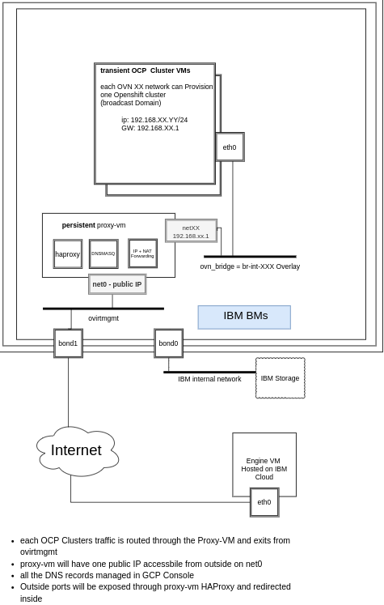

# OpenShift on RHV CI

## Why

Openshift needs to run jobs against a RHV engine to make sure that the RHV installation flow hasn't been broken and to detect bugs during development.
To achive that Openshift needs an **Upstream** (meaning available outside the RH VPN) oVirt engine that it can ran jobs against.

## How

### How the CI infrastructure is built

#### Ovirt Engine

#### Hosts

#### Proxy VM

#### CI Leases

We need CI Leases to make sure we are not overwelming the oVirt engine with jobs that it doesn't have resources to handle, and also to give a specifc job certain information which it requires to run.
Our leases configuration can be found on [boskos.yaml](https://github.com/openshift/release/blob/master/core-services/prow/02_config/_boskos.yaml#L789-L814)
The `ovirt-quota-slice` is a general lease that is needed for each job, it marks a deticated hardware which will be saved for the job, it is required by each job implicitly by stating that the `cluster_profile` is equal to ovirt, for example [here](https://github.com/openshift/release/blob/master/ci-operator/config/openshift/cluster-api-provider-ovirt/openshift-cluster-api-provider-ovirt-master.yaml#L50), see more info on job and leases configuration on the Doc, [Link](https://docs.ci.openshift.org/docs/architecture/step-registry/#implicit-lease-configuration-with-cluster_profile)
The `ovirt-upgrade-quota-slice` is a lease which is specific for upgrade jobs, it is required by each job and represents a storage domain which would be deticated for the upgrade job.
it is required by each upgrade job explicity here [Link](https://github.com/openshift/release/blob/master/ci-operator/step-registry/openshift/upgrade/ovirt/openshift-upgrade-ovirt-workflow.yaml#L17-L19)
It is requested explicity here, see more info on explicit job and leases configuration on the Doc, [Link](https://docs.ci.openshift.org/docs/architecture/step-registry/#explicit-lease-configuration)

For more info on CI leases see Docs, [Link](https://docs.ci.openshift.org/docs/architecture/quota-and-leases/)

Example of a PR for adding leases, [link](https://github.com/openshift/release/pull/21310/files)
Example of a PR for adding a new lease, [link](https://github.com/openshift/release/pull/21069/files)

#### CI Secrets

We need CI Secrets to give a Job sensative data like credentials and pull secret for it to actually run against our oVirt engine, and it is very important to us that the sensative data will only be available for the job.
The is why Openshift CI maintains a Vault istance for us, we can store all of our sensative data in the Vault, and that sensative data will be available to our jobs.
The vault instance address is vault.ci.openshift.org, you need to use the OIDC auth to log in there. After logging in, click on kv, then selfservice and you should see the oVirt secret collection.
Currently we use the "cluster-secrets-ovirt" collection, were we keep:
1. Specific lease files in the form of ovirt-XX.json:
Each lease file coresponds to a secifc CI lease, when a job starts it gets a lease out of the pool of leases, and we use the lease name to select the file from the secrets.
The file contains information for a specific job like the api-vip to use or the cluster name it should have, those fields are uniqe for each lease and corespond to existing infrastructure in the oVirt engine and proxy VM.
For example a CI job start and it gets the "ovirt-10" lease then it will get the information from the ovirt-10.json file.

The job step that extracts the info from the secert is here, [Link](https://github.com/openshift/release/blob/master/ci-operator/step-registry/ipi/conf/ovirt/generate-install-config-params/ipi-conf-ovirt-generate-install-config-params-commands.sh)

2. Upgrade jobs lease files in the form of ovirt-upgrade-X.json:
For each upgrade job we have a seperate storage domain, this was required due to the fact that upgrade jobs need persistant storage to function and run etcd on as opposed to regular jobs which can use emptyDir for etcd.
That is why we have a seperate lease for each upgrade job, because on top of the compute resources it require it also consumes a deticated storage domain.

The job step that extracts the info from the secert is here, [Link](https://github.com/openshift/release/blob/master/ci-operator/step-registry/ipi/conf/ovirt/generate-install-config-params/ipi-conf-ovirt-generate-install-config-params-commands.sh)

3. ovirt.conf:
Contains oVirt engine information which is shared between all jobs, like engine URL and connection info.

It is used in the install config, [here](https://github.com/openshift/release/blob/master/ci-operator/step-registry/ipi/conf/ovirt/generate-install-config/ipi-conf-ovirt-generate-install-config-commands.sh#L8)

4. pull-secret:
The pull-secret which the jobs need to pull resources from the Openshift release image registry, it should never expire, and if it does then #forum_testplatform needs to be contacted to regenerate it.

It is used in the install config, [here](https://github.com/openshift/release/blob/master/ci-operator/step-registry/ipi/conf/ovirt/generate-install-config/ipi-conf-ovirt-generate-install-config-commands.sh#L12)

5. send-event-to-ovirt.sh:
A bash function to send an event to oVirt when the job is starting and ending, it helps to look at the oVirt Engine events and filter then to see information about specific jobs.
It is kept as a secret for historical reasons, it used to contain sensetive information but not any more, it can be ported to a function in the code itself.

6. ssh keys:
To connect to the engine/proxy VM

More information on Openshift CI secrets and how to use them in jobs can be found in the [Docs](https://docs.ci.openshift.org/docs/how-tos/adding-a-new-secret-to-ci/)

### How a oVirt CI job is built

The CI tests are built in a complex multi stage tests architecture which is best explained in the offical documentation, I will deticate this section to point stuff which are specific to the oVirt jobs, and the logic which they have.
If you are not familir with Openshift CI please stop here and read the [Multi-Stage Tests and the Test Step Registry docs](https://docs.ci.openshift.org/docs/architecture/step-registry/) it is important to understand what are Steps, Chains and Workflow to continue to read.

#### oVirt Workflows

Ovirt jobs are grouped into workflows, were each workflow represents a single job that can be triggered and contains all the steps and ENV vars required to run it.
We try to avoid from stating ENV vars in the job definition to prevent configuration issues, we prefer creating another workflow or a step compared to start adding more and more env vars.
Remember that workflows just group steps and chains so you sould have a workflow for each job type.
So for example lets take a look at the conformace workflows:
The regular job that is triggered for master, 4.9,4.8 is found [here](https://github.com/openshift/release/blob/master/ci-operator/step-registry/openshift/e2e/ovirt/conformance/openshift-e2e-ovirt-conformance-workflow.yaml)
But on 4.7 and 4.6 we didn't have affinity groups in the install config, so we needed to create a different workflow which will describe a 4.7/6 job, it is almost identical to the regular workflow, but it requires a specifc chain for 4.6 and 4.7. see [Link](https://github.com/openshift/release/blob/master/ci-operator/step-registry/openshift/e2e/ovirt/conformance/release-4.6-4.7/openshift-e2e-ovirt-conformance-release-4.6-4.7-workflow.yaml#L5).

If we take a closer look into the workflows, we deticate:
- `pre` section to all configuration which is required to setup the openshift cluster, after the `pre` section we should have a fully functional cluster which is ready for tests.
- `test` section to run the specific test suite which is specifice in the `TEST_SUITE` and `TEST_TYPE` env vars
- `post` section to extract information from the cluster and destroy the cluster (clean up the env).

The oVirt csi, minimal and conformance workflows can be found [here](https://github.com/openshift/release/tree/master/ci-operator/step-registry/openshift/e2e/ovirt) and the upgrade workflows can be found [here](https://github.com/openshift/release/tree/master/ci-operator/step-registry/openshift/upgrade/ovirt).

Each workflow contains the env vars and steps/chains which are required for it to run, you can look at the different steps to see how the env vars are used.
We also try to document a clear explantation on what is the workflow and how it differs from other workflows.

#### oVirt Chains

The chains are the most simple section, chains just group steps and give then meaning do it would be clearer on the workflow.
The main big chains are the pre and post chains (as explained above), they can be found [here](https://github.com/openshift/release/tree/master/ci-operator/step-registry/ipi/ovirt), you can take a look at then and see that they contain other chains and steps.

#### oVirt Steps

Steps are the moving pieces of the Job and contain the logic to run for each of them.
We have steps that are specific to oVirt which we maintain [Link](https://github.com/openshift/release/tree/master/ci-operator/step-registry/ipi/conf/ovirt) and steps that are shared between providers

### Where are the CI jobs located?

It is ea

### Types of jobs and the difference between them

#### Regular

#### CSI

#### Conformance

#### Upgrade

### Difference between of Upgrade jobs and Regular jobs

## Common tasks

### Adding an oVirt job to the Openshift CI

### Adding a job lease to the Openshift CI

### 

